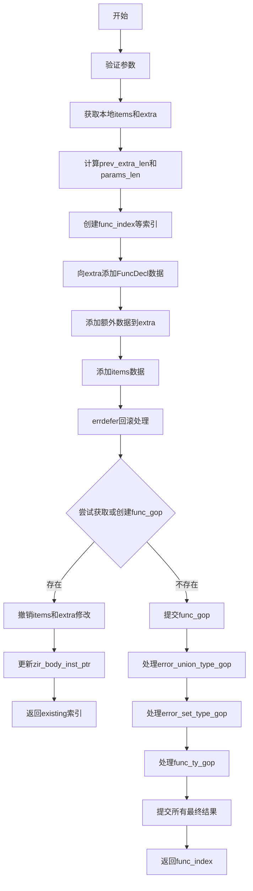

好的，我需要为给定的Zig函数`getFuncDeclIes`绘制流程图。首先，我需要理解这个函数的结构和逻辑流程。这个函数的主要功能似乎是处理函数声明，并在内部池（InternPool）中管理相关的索引和类型。

首先，我会通读代码，识别主要的步骤和条件分支。函数开始于参数验证，确保返回类型和参数类型有效。接着，它获取本地项和额外空间，确保足够的容量。然后，创建多个索引（func_index, error_union_type等），并将它们添加到不同的结构中。

接下来，代码处理了错误恢复的情况（errdefer块），确保在出错时回滚更改。之后，尝试获取或创建现有的函数类型（func_gop），如果存在现有项，则撤销之前的添加操作，并处理可能的ZIR指令更新。如果不存在，继续创建并确认其他类型（error_union_type, error_set_type, func_ty），最后提交所有更改。

在这个过程中，需要注意条件判断和错误处理，如`if (func_gop == .existing)`的分支，以及多个`getOrPutKeyEnsuringAdditionalCapacity`的调用。此外，还要考虑各个步骤之间的依赖关系和数据流动。

绘制流程图时，需要将这些步骤和条件分支以图形方式表示，使用不同的形状（如矩形表示操作，菱形表示判断，箭头表示流程方向）。确保每个主要操作和条件分支都有对应的节点，并正确连接以反映代码的执行顺序。

可能需要简化一些重复或相似的步骤，例如多次调用`getOrPutKeyEnsuringAdditionalCapacity`，可以将它们概括为一个通用的流程节点，以保持图表的清晰性。同时，需要标注关键变量和条件，使流程图更易理解。

最后，检查流程图的逻辑是否与代码一致，确保所有重要的路径都被覆盖，包括错误处理路径和正常执行路径。
================================================
