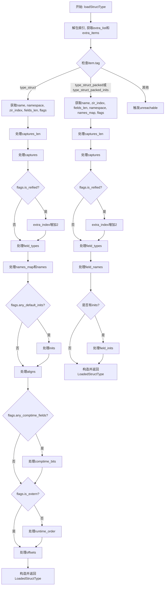

嗯，我现在需要为这个Zig函数`loadStructType`画一个流程图。首先，我得先理解这个函数的结构和逻辑。看起来这个函数主要是根据不同的结构体类型（比如`type_struct`、`type_struct_packed`等）来加载不同的结构体信息。函数内部有很多条件判断和不同的分支处理，所以流程图应该会有多个分支。

首先，函数开始于`pub fn loadStructType`，接收一个`InternPool`指针和一个索引，返回一个`LoadedStructType`。然后它解包索引，获取一些额外的数据列表`extra_list`和`extra_items`，接着根据`item.tag`进行不同的处理。

主要的switch语句分为三个分支：`.type_struct`、`.type_struct_packed`和`.type_struct_packed_inits`，以及默认的`else => unreachable`。每个分支对应不同的结构体类型，处理方式不同，比如字段的排列、是否有初始化值、对齐方式等。

对于`.type_struct`的情况，首先获取名称、命名空间、zir索引、字段长度等基本信息，然后根据不同的标志位（flags）处理可能存在的捕获、类型哈希、字段类型、名称映射、初始化值、对齐、编译时位、运行时顺序、偏移量等。最后构造并返回一个`LoadedStructType`实例。

对于`.type_struct_packed`和`.type_struct_packed_inits`的情况，处理流程类似，但结构更紧凑，可能有不同的字段排列方式，比如不需要处理对齐或运行时顺序等。

接下来，我需要将这些步骤转化为流程图。流程图应该从函数入口开始，然后根据不同的`item.tag`分支出不同的处理路径。每个分支内部有多个步骤，如获取字段、处理标志位、计算偏移等，可能需要用条件判断来表示不同的处理逻辑。

需要注意的是，有些步骤是条件性的，比如根据`flags.any_captures`是否存在来决定是否处理捕获，或者根据`flags.is_reified`来增加额外的索引。这些条件应该在流程图中用菱形判断框表示。

此外，每个分支最后都会构造并返回`LoadedStructType`，所以在各个分支处理完毕后，应该有一个共同的结束点，返回结果。

可能的错误点：在转换代码逻辑到流程图时，可能会遗漏某些条件分支，或者步骤顺序不正确。需要仔细检查每个分支中的处理步骤，确保流程正确。

最后，根据上述分析，使用Mermaid语法绘制流程图，确保每个步骤和判断都正确对应代码中的逻辑。
================================================

该流程图：
1. 从函数入口开始解包索引并获取数据
2. 通过核心switch分支处理两种主要结构类型
3. 用菱形节点表示条件判断（flags/存在性检查）
4. 对type_struct分支详细展示了字段初始化、对齐、位标记等特性处理
5. 对packed类型分支简化了部分特性处理流程
6. 最终统一返回构造好的LoadedStructType对象
7. 使用垂直流向展示代码的线性执行顺序，同时保持分支结构的清晰可视