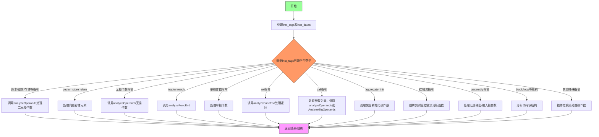

嗯，用户让我用Mermaid画出一个Zig函数的流程图。首先，我需要理解这个函数的结构和逻辑。这个函数叫做analyzeInst，看起来像是编译器中的一部分，处理不同的指令类型，并根据不同的指令类型执行相应的分析操作。

首先，我得通读整个函数，看看它的大致流程。函数接收一些参数，包括分析对象a、pass类型、数据data、指令索引inst。然后根据指令的类型（通过inst_tags来判断）进入不同的分支处理逻辑。

函数开始处，获取了ip、inst_tags和inst_datas。然后是一个大的switch语句，根据不同的指令类型执行不同的操作。每个case处理不同的指令，比如算术操作、存储、控制流等，最后调用analyzeOperands或其他函数处理操作数。

接下来，我需要确定如何将这样的逻辑转换为流程图。流程图通常包括开始、判断节点、处理节点和结束节点。由于这个函数主要是一个大的switch结构，每个case对应不同的处理逻辑，可能需要用多个判断分支来表示不同的指令类型。

可能的步骤是：
1. 开始节点：函数开始。
2. 获取ip、inst_tags、inst_datas。
3. 根据inst_tags进入switch判断。
4. 每个case分支处理对应的指令类型，可能会调用analyzeOperands或其它函数。
5. 处理完成后返回结果或结束。

但具体的switch分支非常多，不可能在流程图中详细列出每一个case。所以可能需要抽象处理，比如将相似的指令类型分组，或者用注释说明主要分支。

此外，注意到有些case处理会调用不同的函数，如analyzeOperands、analyzeFuncEnd、analyzeInstBr等，这些调用也需要在流程图中体现为不同的处理节点。

另一个挑战是处理那些带有循环或条件判断的case，比如处理call指令时的参数处理，可能需要循环遍历参数。这时候在流程图中可能需要表示循环结构。

由于代码中存在多个返回点，流程图需要正确表示每个分支的结束点，例如return语句的位置。

可能的Mermaid流程图结构如下：
- 开始
- 获取指令类型
- 根据类型分支到不同的处理块
- 每个处理块调用相应的函数或处理操作数
- 结束

需要确保每个主要分支都有对应的节点，并且复杂的处理（如循环处理参数）用适当的流程图符号表示。

现在，我需要将这些逻辑转化为Mermaid语法。注意，Mermaid的流程图语法支持条件判断、子程序和循环结构。例如，使用菱形表示判断，矩形表示处理步骤，箭头表示流程方向。

最终，流程图可能大致如下：

开始 -> 获取inst_tags和inst_datas
-> 判断指令类型
-> 根据不同类型进入不同的处理分支
-> 每个分支处理对应的操作数或调用函数
-> 结束

对于像call指令这样的复杂情况，可能需要展开子流程，比如处理参数列表，判断参数数量是否超过某个阈值，然后选择不同的处理方式。

不过，由于代码中的分支非常多，可能需要简化，只展示主要的结构，而不是每一个case。例如，将算术操作、存储操作、控制流等作为主要分支，然后在每个分支下简要说明处理方式。

另外，注意函数中有多个return语句，每个分支处理完后直接返回，所以流程图中的每个处理分支应该指向结束节点。

总结来说，流程图的结构大致是：

开始
-> 获取指令信息
-> 根据指令类型分支到不同处理
-> 处理操作数或调用特定函数
-> 结束

现在，我需要用Mermaid语法实现这个结构，并尽量覆盖主要的处理分支，同时保持图表的可读性。
================================================

流程图说明：
1. 从获取指令信息开始
2. 通过大型switch结构区分指令类型
3. 主要处理分支包括：
   - 二元操作数处理
   - 向量存储特殊处理
   - 无操作数指令
   - 函数终止处理
   - 单操作数指令
   - 函数返回处理
   - 调用指令参数处理
   - 聚合初始化处理
   - 控制流指令转接
   - 汇编指令特殊处理
   - 代码块结构分析
4. 所有分支最终汇聚到返回节点
5. 使用不同颜色区分开始/判断/结束节点