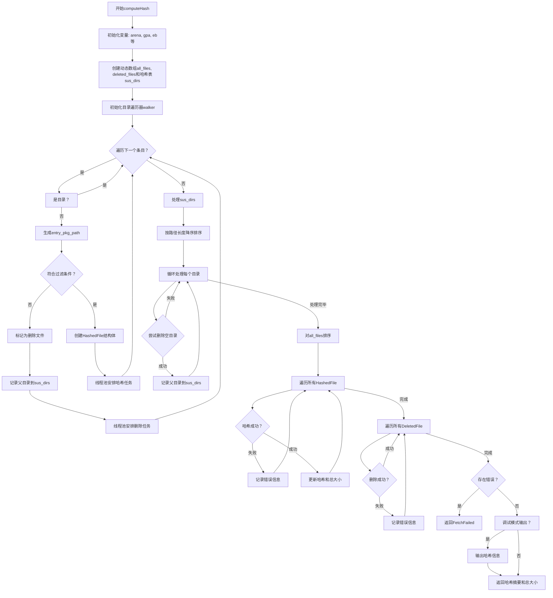

好的，我现在需要帮助用户用Mermaid画出给定Zig函数的流程图。首先，我需要仔细阅读并理解这个函数的逻辑。

这个函数叫做computeHash，属于Fetch结构体的方法。它的主要功能是计算包的哈希值。看起来它会遍历指定路径下的文件，根据过滤条件决定是包含文件还是删除文件，然后进行哈希计算，并处理可能的错误。

首先，函数开始时初始化了一些变量，比如arena、gpa、eb、thread_pool和root_dir。这些都是用于内存分配、错误处理和线程管理的。接下来，它创建了两个动态数组：all_files用于存储需要哈希的文件，deleted_files用于记录被删除的文件。还有一个sus_dirs的哈希表，用来跟踪可能需要删除的空目录。

然后，函数使用walker遍历根目录下的所有条目。对于每个条目，如果是目录则跳过。接着，处理每个文件的路径，检查是否满足过滤条件。如果不满足，就将文件标记为待删除，并记录其父目录到sus_dirs中，以备后续检查是否为空目录。如果满足条件，则创建HashedFile结构体，并在线程池中安排任务来计算哈希值。

在处理完所有文件后，函数对sus_dirs进行排序，按路径长度降序排列，这样可以先处理子目录，再处理父目录。然后尝试删除这些可能为空的目录，如果删除成功，还会将其父目录加入sus_dirs继续检查。

接下来，对all_files中的文件进行排序，然后逐个处理哈希结果，如果有失败的情况，记录错误信息。同样检查被删除文件的操作是否成功。如果有任何失败，返回错误。

最后，如果启用了调试选项，会输出哈希信息。最终返回计算得到的哈希摘要和总大小。

现在需要将这些步骤转化为流程图。流程图应该从函数入口开始，按照逻辑顺序展示各个步骤，包括初始化、遍历文件、处理过滤条件、多线程处理哈希和删除、处理空目录、错误处理等。需要注意条件判断、循环以及并行处理的部分。

可能的流程步骤：

1. 初始化变量（arena, gpa, eb等）
2. 创建动态数组和哈希表（all_files, deleted_files, sus_dirs）
3. 初始化walker开始遍历目录
4. 遍历每个条目：
   a. 如果是目录，跳过
   b. 检查路径是否符合过滤条件
   c. 不符合：标记为删除，记录父目录到sus_dirs，安排删除任务
   d. 符合：创建HashedFile，安排哈希任务
5. 遍历结束后，处理sus_dirs：
   a. 排序目录路径（长度降序）
   b. 循环检查每个目录是否为空，尝试删除，并处理父目录
6. 对all_files排序
7. 处理每个文件的哈希结果和错误
8. 处理被删除文件的错误
9. 如果有错误，返回失败
10. 调试模式下输出哈希信息
11. 返回哈希摘要和总大小

在流程图中，需要处理循环、条件判断以及并行任务（如线程池中的删除和哈希任务）。不过，Mermaid的流程图可能无法直接表示并行处理，可能需要用分支来表示任务的分发，然后汇总结果。

需要注意各个步骤之间的顺序和条件，比如sus_dirs的处理是在遍历文件之后进行的，错误处理是在收集所有结果后统一检查的。

现在将这些步骤转化为Mermaid的流程图语法，确保逻辑清晰，步骤正确。
================================================
