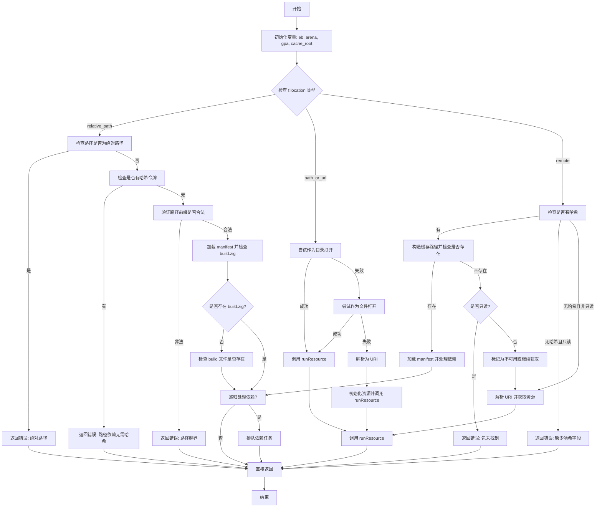

好的，我需要为提供的 Zig 代码中的 `run` 函数绘制一个流程图。首先，我需要理解这个函数的结构和逻辑。

首先，函数开始初始化一些变量，比如 `eb`、`arena`、`gpa` 和 `cache_root`。然后检查 `f.location` 的不同情况：`.relative_path`、`.remote` 和 `.path_or_url`。每个分支有不同的处理逻辑。

对于 `.relative_path`，需要检查路径是否是绝对路径，是否有哈希令牌，以及路径是否在预期的前缀内。如果不符合条件，会返回错误。如果符合，则加载 manifest 并检查是否存在 `build.zig` 文件，然后根据是否递归来决定是否排队依赖任务。

对于 `.path_or_url`，尝试作为目录或文件打开，如果失败则解析为 URI，并初始化资源。然后调用 `runResource`。

对于 `.remote`，处理哈希是否存在，检查缓存中是否存在对应的包。如果存在，加载 manifest 并处理依赖；否则，根据是否只读或懒加载状态来处理错误或继续获取资源。

最后，如果远程没有哈希且在只读模式下，返回错误。否则，继续获取并解压远程资源。

接下来，我需要将这些逻辑步骤转化为流程图。每个分支条件用菱形判断框，处理步骤用矩形框，错误处理和返回用终止框。需要注意各个条件之间的连接，特别是错误路径和正常流程的转移。

可能需要多次检查代码以确保所有条件分支都被覆盖，并正确映射到流程图中的路径。同时，注意函数中的递归调用部分，比如 `queueJobsForDeps(f)` 和 `runResource`，是否需要单独的子流程或合并到主流程中。

现在，根据上述分析，绘制对应的 Mermaid 流程图。
================================================
