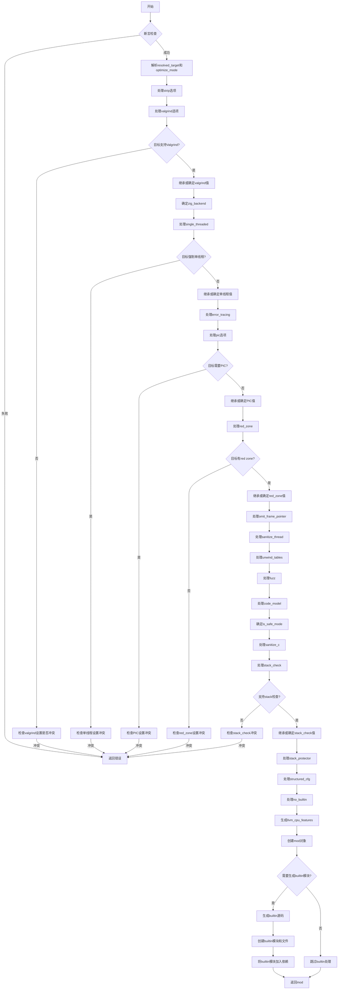

好的，我现在需要帮用户用Mermaid画出他们提供的Zig函数的流程图。首先，我需要仔细阅读并理解这段代码的功能和结构。这段代码是`create`函数，属于一个模块或包的创建过程。函数接收一个分配器`arena`和选项`options`，返回一个`*Package.Module`或者错误。

首先，函数开始进行一系列的断言检查，确保传入的选项符合全局配置的要求。例如，如果`options.inherited.sanitize_thread`为真，那么必须确保全局的`any_sanitize_thread`也为真。接下来，函数解析目标平台、优化模式、strip选项、valgrind支持等。每个配置项的处理逻辑可能涉及条件判断、错误处理，以及从父模块或全局配置中继承默认值。

然后，代码处理各种特定的配置，如`single_threaded`、`error_tracing`、`pic`（位置无关代码）、`red_zone`、`omit_frame_pointer`、`sanitize_thread`、`unwind_tables`、`fuzz`、`code_model`、`is_safe_mode`、`sanitize_c`、`stack_check`、`stack_protector`、`structured_cfg`、`no_builtin`等。每个配置项的处理逻辑可能包括目标平台的支持检查、继承父配置或全局默认值，以及可能的错误返回。

接下来，处理`llvm_cpu_features`，根据目标平台的特征生成LLVM所需的CPU特性字符串。这部分涉及到遍历CPU特性，生成启用和禁用的特性列表，并进行字符串拼接。

之后，创建`Module`实例`mod`，并填充其各个字段的值，包括目标信息、优化模式、线程模式、错误跟踪、valgrind支持、各种编译选项等。

然后处理`builtin_mod`，如果不存在，则生成内置模块的源代码，并创建相应的`Module`和`File`实例。这里涉及到哈希生成、路径处理、模块初始化等步骤。最后，将内置模块添加到当前模块的依赖中。

整个函数的流程涉及多个条件分支、错误处理、配置继承和模块初始化步骤。为了用Mermaid画出流程图，需要将这些步骤分解成不同的节点，并用箭头表示执行顺序和条件分支。每个主要的条件判断（如if语句）会导致不同的路径，错误返回用终止节点表示。此外，循环和子流程（如生成内置模块）可能需要子图或单独的节点。

需要注意的是，代码中有多个`break :b`语句，这些是Zig中的标签中断，用于在块表达式中提前退出。在流程图中，这可以表示为条件判断后的不同路径。

在绘制流程图时，可能需要将复杂的条件判断简化为决策节点，例如“是否支持Valgrind？”或“是否指定了strip选项？”。每个决策节点有两个或多个出口，分别对应不同的处理逻辑。对于错误情况，流程会终止并返回错误。

生成内置模块的部分是一个相对独立的子流程，可以作为一个子图处理，包含生成源代码、创建模块和文件实例、处理哈希和路径等步骤。

最后，整合所有节点和箭头，确保流程图的逻辑与代码执行顺序一致，覆盖所有主要路径和错误处理情况。可能需要多次迭代调整，以确保流程图的准确性和可读性。
================================================

这个流程图展示了：
1. 从参数检查到目标平台解析的主流程
2. 各个编译选项的继承和验证过程
3. 错误处理路径
4. 内置模块的生成逻辑
5. 最终模块对象的创建和返回

主要决策点用菱形表示，关键操作用矩形表示，错误路径统一指向错误返回节点。流程覆盖了代码中的所有主要配置项处理逻辑，并保持了与实际代码相似的执行顺序。