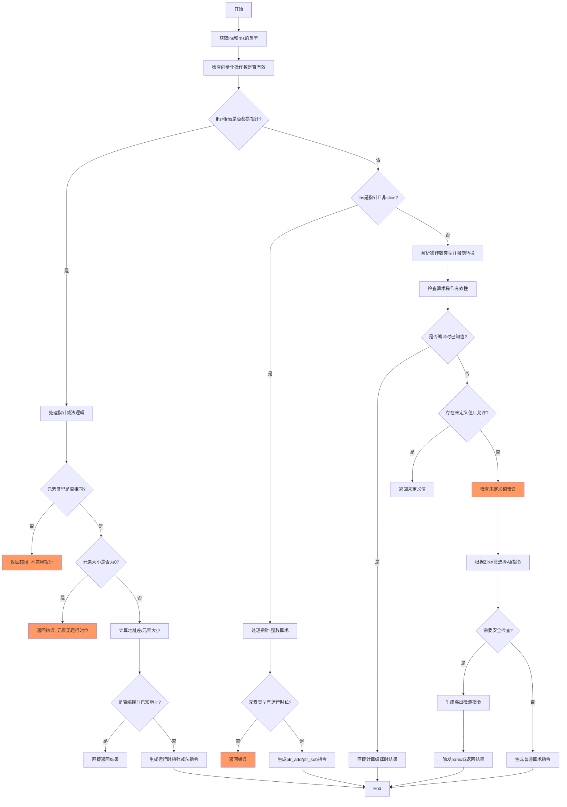

嗯，我需要为这个Zig函数`analyzeArithmetic`画一个流程图。首先，我得通读代码，理解它的逻辑结构。函数看起来挺复杂的，有很多条件判断和不同的执行路径。让我先大致理清楚函数的各个部分。

首先，函数开始部分，获取了`lhs_ty`和`rhs_ty`的类型，然后检查它们是否可以向量化。接着，处理指针类型的操作，特别是当左右操作数都是指针时的情况，比如指针减法，这时候需要确保元素类型相同，计算元素大小，处理可能的溢出，以及运行时检查。如果指针类型不符合条件，会返回错误。

然后，如果左操作数是指针而右操作数不是指针的情况，处理指针算术运算，比如加减，这时候需要检查元素类型是否有运行时位，并调用`analyzePtrArithmetic`方法。

接下来，处理非指针类型的算术运算，解析类型，强制类型转换，检查算术操作的有效性。这里会根据操作数的类型（整数、浮点数等）进行不同的处理，处理编译时已知的值，以及可能的未定义行为检查。

之后，根据不同的Zir标签（如.add, .sub等）确定对应的Air指令标签，处理可能的溢出和安全检查，使用`addBinOp`生成相应的指令。

在安全检查部分，如果启用了安全检查，会生成溢出检查的指令，并在检测到溢出时触发panic。

现在，我需要将这些步骤转化为流程图的结构。由于函数中有多个条件分支，流程图应该包含多个判断节点，每个判断节点对应代码中的一个条件语句，比如检查指针类型、操作数是否为编译时已知值、是否启用安全检查等。

可能的步骤：

1. 开始
2. 获取lhs和rhs的类型
3. 检查向量化操作数是否有效
4. 判断lhs和rhs是否为指针类型
   - 如果是，处理指针算术（包括指针减法和指针与整数运算）
   - 如果否，进入普通算术处理流程
5. 解析类型，强制类型转换
6. 检查算术操作的有效性（如类型是否支持该操作）
7. 处理编译时已知值的情况，如直接计算结果或检查未定义值
8. 根据Zir标签确定对应的Air指令
9. 处理安全检查和溢出检测
10. 生成最终的Air指令并返回结果

需要注意各个条件分支的嵌套关系，例如在指针处理内部还有子条件判断，比如指针减法的元素类型是否相同，元素大小是否为0，是否需要在运行时计算地址差等。此外，普通算术处理中也有多个分支，比如处理整数和浮点数的不同逻辑，以及是否允许未定义值等。

需要确保流程图中的每个判断节点都有明确的是/否分支，并且每个分支最终汇聚到正确的结束点。同时，错误处理路径也需要在流程图中体现，比如返回错误的情况。

可能还需要将一些复杂的逻辑拆分成子流程，比如指针算术处理和安全检查部分，以保持流程图的可读性。

最后，使用Mermaid语法绘制流程图，确保节点和连接线正确反映代码的逻辑流程。
================================================

### 流程说明：
1. **指针处理分支**:
   - 当左右操作数均为指针时，处理指针减法逻辑，检查元素类型和大小。
   - 若指针与非指针操作数组合，处理指针-整数算术操作。
   - 错误路径用红色高亮标记。

2. **常规算术分支**:
   - 强制类型转换后，检查编译时已知值，直接计算结果。
   - 处理未定义值（允许则返回`undef`，否则报错）。
   - 根据安全模式选择是否插入溢出检测指令。

3. **指令生成**:
   - 最终根据Zig IR标签（如`.add`, `.sub`）转换为具体的LLVM IR指令。
   - 安全检查分支会生成额外的溢出检测和panic逻辑。