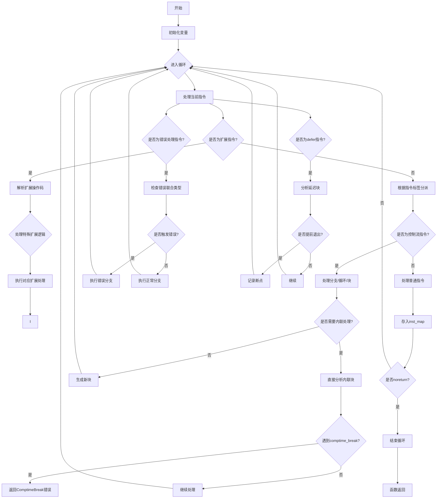

嗯，我需要为这个Zig函数`analyzeBodyInner`画一个流程图。首先，我要理解这个函数的结构和逻辑流程。看起来这个函数是用于语义分析，处理ZIR（Zig Intermediate Representation）指令的。

函数开始的时候，初始化了一些变量，比如`inst_map`，然后进入一个无限循环`while (true)`，逐个处理指令。每个指令根据其标签（tag）被分派到不同的处理函数，比如`.alloc`、`.cmp_lt`等等。对于每个指令，都会进行一些处理，并将结果存入`inst_map`中。

在处理过程中，有一些特殊情况需要考虑，比如遇到`.compile_error`或`.ret_implicit`等指令时，会跳出循环。另外，还有一些扩展指令（`.extended`），需要进一步根据操作码（opcode）处理不同的情况。

还有一些控制流指令，如`.condbr`、`.loop`、`.block`等，需要处理条件分支、循环和块结构。特别是处理内联块（`.block_inline`）时，需要直接分析块体而不创建新块，但可能需要回溯生成块。

对于错误处理，比如`.try`和`.try_ptr`，需要检查错误联合类型，并根据是否出错执行不同的代码路径。此外，还有`.defer`和`.defer_err_code`处理延迟执行的代码块。

最后，在处理完所有指令后，如果遇到`noreturn`指令，循环结束，函数返回。

接下来，我需要将这些逻辑步骤转化为流程图。可能的结构包括：

1. 函数入口，初始化变量。
2. 进入循环，处理每个指令。
3. 根据指令标签分派到不同的处理逻辑。
4. 处理扩展指令和特殊控制流。
5. 处理错误和延迟指令。
6. 检查是否为`noreturn`，决定是否结束循环。
7. 循环结束，函数返回。

需要注意循环中的各种分支和可能的退出条件，尤其是遇到`noreturn`指令或错误时的处理。此外，处理内联块和条件分支时的递归或嵌套流程也需要详细表示。
================================================
