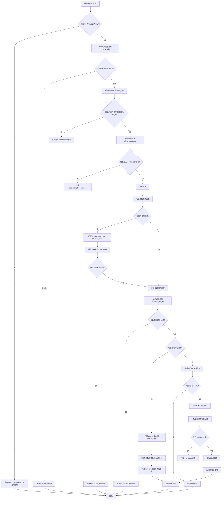

嗯，用户让我用Mermaid画出一个Zig函数的流程图。首先，我需要理解这个函数的结构和逻辑。这个函数是`analyzeCall`，看起来是处理函数调用的语义分析。代码有点长，有很多条件和分支，比如处理异步调用、泛型函数、内联调用等。

首先，我需要确定函数的主要流程。函数开始检查调用修饰符，比如是否异步。然后处理函数类型，检查调用约定是否合法。接着解析被调用函数的值，判断是否是编译时已知的函数或外部函数。之后处理泛型函数的情况，包括参数类型和返回类型的推断。

接下来，处理内联调用和编译时调用，这里可能需要进入新的块（block）进行分析。函数还处理错误返回跟踪、参数验证、运行时参数的生成，最后生成调用指令或处理递归调用。

画流程图的时候，需要把这些主要步骤分解成节点，并用箭头连接起来。要注意条件分支，比如是否泛型、是否内联、是否是编译时调用等。每个条件分支可能导致不同的处理路径。

可能需要将整个流程分为几个大块：初始化检查、处理调用约定、解析被调用函数、处理泛型参数和返回类型、生成调用指令、处理内联和编译时调用。每个大块内部再细分步骤。

需要注意的是，代码中有很多错误处理，比如`failWithUseOfAsync`或`failWithNeededComptime`，这些应该在流程图中表示为错误出口。另外，递归调用和依赖处理也需要特别标注。

可能还需要处理内联调用时的参数验证、依赖声明、以及结果的内存化（memoization）。这部分逻辑比较复杂，需要确保在流程图中正确表达各个条件判断和处理步骤。

总之，流程图需要覆盖函数的所有主要路径，包括正常流程和错误处理，同时清晰地展示各个条件分支和循环结构。可能需要使用不同的形状来表示开始、结束、过程、判断等元素，确保逻辑清晰易读。
================================================

流程图说明：
1. 函数从检查调用修饰符开始，处理异步调用错误
2. 验证函数类型和调用约定的合法性
3. 处理泛型函数的参数类型推导和实例化
4. 分运行时调用和内联调用两条路径：
   - 运行时路径生成调用指令并处理尾部优化
   - 内联路径创建子块分析函数体，处理递归检查和memoization
5. 最终统一处理结果使用验证并返回
6. 所有错误路径直接跳转到结束节点
7. 包含关键条件判断节点（菱形）和操作节点（矩形）