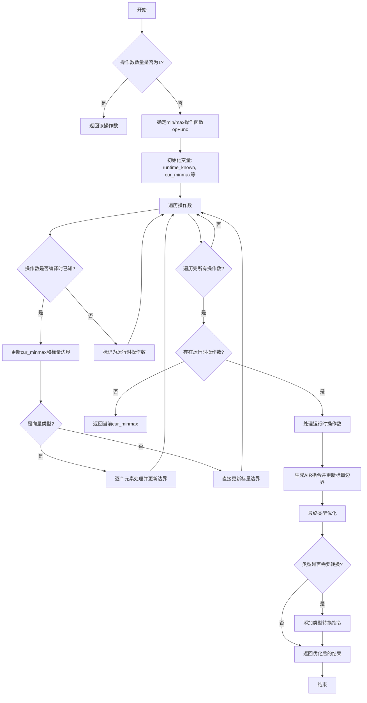

好的，我需要为给定的Zig函数`analyzeMinMax`绘制一个流程图。首先，我需要理解这个函数的结构和逻辑。让我先通读代码，了解其各个部分的作用。

函数`analyzeMinMax`似乎处理多个操作数的最小值或最大值计算，考虑编译时和运行时的不同情况。它首先处理所有编译时可确定的操作数，然后处理运行时操作数，最后优化结果的类型。

首先，函数检查操作数数量，如果只有一个，直接返回。然后根据`air_tag`选择`min`或`max`操作。接着初始化一些变量来跟踪运行时已知的操作数、当前的最小/最大值、标量边界状态等。

接下来，遍历所有操作数，处理编译时可解析的值，更新当前的最小/最大值和标量边界。如果遇到向量类型，则逐个元素处理。对于运行时操作数，使用`runtime_known`位集来标记，后续处理这些运行时操作数。

在处理完所有编译时操作数后，检查是否有运行时操作数。如果有，进入运行时处理阶段，生成相应的AIR指令，并继续更新标量边界。最后，根据已知的标量边界优化结果类型，可能进行类型转换。

现在，我需要将这些步骤转化为流程图。流程图的开始是函数入口，然后根据操作数数量判断是否直接返回。接着处理编译时操作数，然后处理运行时操作数，最后类型优化并返回结果。

需要注意的是条件分支，比如操作数数量是否为1，是否有运行时操作数，标量边界状态的变化，以及类型是否为向量或浮点等。这些都需要在流程图中用判断节点表示。

可能的结构如下：
1. 开始
2. 检查操作数数量是否为1 → 是 → 返回该操作数
3. 否 → 确定min/max操作函数
4. 初始化变量（runtime_known, cur_minmax等）
5. 遍历操作数：
   a. 解析操作数值
   b. 如果是编译时已知 → 更新当前min/max和标量边界
   c. 处理向量元素
6. 检查是否有运行时操作数 → 无 → 返回当前min/max
7. 有 → 处理运行时操作数，生成AIR指令，更新标量边界
8. 最终类型优化，返回结果

可能还需要处理特殊情况，比如所有操作数都是comptime_int，或包含浮点数时的处理。

在绘制流程图时，需要使用不同的形状表示开始/结束、处理步骤、条件判断等。例如，菱形表示判断，矩形表示处理步骤，箭头表示流程方向。

需要确保每个条件分支都有明确的是/否路径，并且步骤之间的顺序正确。特别是循环遍历操作数部分，需要用循环结构表示。

总结来说，流程图应涵盖以下主要部分：
- 初始检查和返回
- 编译时操作数处理循环
- 运行时操作数处理（如果有）
- 类型优化和最终返回

现在，根据上述分析，用Mermaid语法绘制流程图。
================================================
