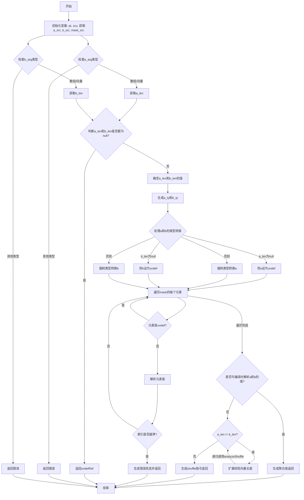

嗯，我需要为这个Zig函数`analyzeShuffle`画一个流程图。首先，我得仔细理解这个函数的结构和逻辑流程。

函数开始部分声明了一些变量，比如`pt`, `zcu`，以及获取了三个参数的源代码位置。然后检查`a_arg`和`b_arg`的类型，确定它们的长度是否为数组或向量。如果其中一个是未定义的，可能返回未定义的结果。

接下来，处理`a`和`b`的类型转换，确保它们的长度符合要求。然后遍历`mask`的每个元素，检查索引是否越界。如果越界，生成相应的错误信息。

如果所有检查通过，并且`a`和`b`的值可以在编译时解析，那么生成对应的聚合值。否则，如果运行时需要处理不同长度的向量，递归调用`analyzeShuffle`来扩展较短的向量，使其长度一致。最后生成`shuffle`指令。

流程图中应该包括以下几个主要步骤：

1. 初始化变量和获取参数源位置。
2. 确定`a`和`b`的类型和长度，处理可能的错误。
3. 遍历`mask`的每个元素，检查索引的有效性，处理错误。
4. 如果可以在编译时解析值，生成聚合值返回。
5. 如果运行时需要处理不同长度的向量，递归扩展较短向量。
6. 生成最终的`shuffle`指令。

需要注意的是递归调用部分的条件判断，以及错误处理的分支。每个条件判断（如`maybe_a_len == null`，`a_len != b_len`等）都会影响流程的分支。

另外，在遍历`mask`时，每个元素的处理可能中途触发错误，导致流程提前返回。同时，递归调用自身的情况也需要在流程图中体现。

现在需要将这些步骤用Mermaid的流程图语法表示出来，注意正确的节点连接和条件分支的箭头标注。
================================================
