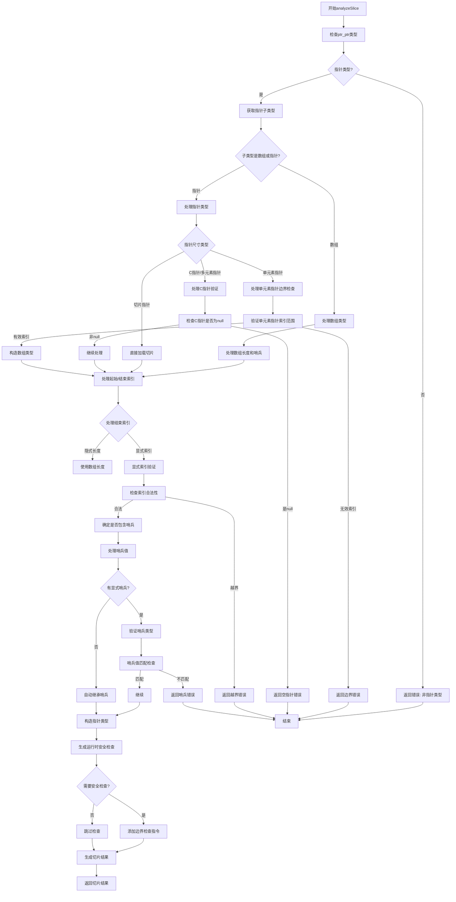

好的，我现在需要帮助用户将给定的Zig函数`analyzeSlice`转换为Mermaid流程图。首先，我需要理解这个函数的结构和逻辑流程，然后才能准确地绘制出流程图。

首先，我会通读代码，了解函数的主要步骤。这个函数似乎负责分析切片操作，处理指针、数组、边界检查、哨兵值（sentinel）等。函数参数很多，说明它需要处理多种不同的情况和错误检查。

接下来，我需要确定函数的主要分支和逻辑结构。例如，函数开始时检查指针类型，如果是数组或指针类型，会进入不同的处理分支。然后处理起始和结束索引，进行类型转换和边界检查。之后处理哨兵值，最后构造并返回结果。

需要注意的几个关键部分：
1. 检查`ptr_ptr_ty`的类型，确定是数组还是指针，以及不同的指针类型（如单元素指针、C指针等）。
2. 处理起始和结束索引，包括类型转换和边界检查。
3. 处理哨兵值，确保其正确性。
4. 运行时安全检查，如空指针检查、索引越界检查。
5. 构造并返回最终的切片结果。

可能的错误处理和分支：
- 当指针类型不符合预期时，返回错误。
- 处理单元素指针时的边界检查，确保起始和结束索引在允许范围内。
- 数组和切片类型的长度处理，包括带哨兵的情况。
- 运行时安全检查，如确保起始索引不大于结束索引，非空指针等。

在绘制流程图时，需要将这些步骤和分支清晰地表示出来，使用条件判断（菱形框）和处理步骤（矩形框），以及错误处理（可能用红色或特殊形状表示）。

还需要注意流程图的层次结构，将主要流程放在左侧，错误处理分支放在右侧，保持逻辑清晰。可能的结构是从顶部开始，逐步向下，每一步根据条件分支出不同的处理路径。

最后，确保流程图覆盖所有关键步骤，包括参数检查、类型处理、索引计算、安全检查、结果构造等，并且正确连接各个步骤之间的逻辑关系。
================================================

这个流程图的关键特点：
1. 使用菱形框表示条件分支
2. 用黄色背景框表示错误处理路径
3. 覆盖了主要处理路径：
   - 指针类型验证
   - 数组/指针类型分支处理
   - 索引边界检查
   - 哨兵值处理
   - 运行时安全检查
   - 最终结果构造
4. 保留了Zig代码中的核心验证逻辑：
   - 单元素指针的特殊处理
   - C指针的非空检查
   - 哨兵值的显式/隐式处理
   - 数组长度和切片长度的不同处理方式
5. 使用垂直布局保持逻辑流程的清晰性

可以通过Mermaid的交互功能展开/折叠不同处理分支，也可以根据需要使用颜色标记不同安全等级（如红色表示错误路径，绿色表示安全路径）。