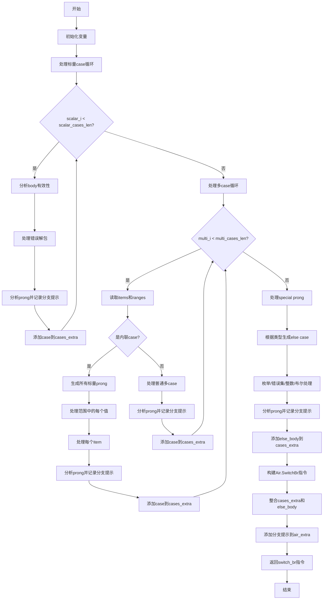

嗯，我需要用Mermaid来画这个Zig函数的流程图。首先，我得理解这个函数是做什么的。看起来这个函数叫做analyzeSwitchRuntimeBlock，可能是用来分析switch语句的运行时情况的。参数很多，可能有Sema（语义分析）、SwitchProngAnalysis（switch分支分析）、Block（代码块）等等。

函数开始部分，定义了一些变量，比如pt、zcu、gpa、ip。然后创建了一个cases_extra的列表，估计是存储switch的各个case的信息。还有branch_hints，可能是分支提示。然后创建了一个case_block，看起来是处理每个case的子块。

接下来是处理标量case的循环，scalar_i从0到scalar_cases_len。在循环里，获取每个case的信息，处理body，分析是否联合类型，然后根据条件确定是否分析body。然后处理错误解包和分支提示，最后将信息添加到cases_extra和branch_hints里。

然后是处理多case的部分，multi_i循环。这里可能处理多个item或范围的case。如果是内联的，会生成所有可能的标量prong。每个range和item都会生成对应的case，并添加到cases_extra。同样处理分支提示。

接着处理special prong，比如else分支。这里可能处理枚举、错误集、整数、布尔类型的else情况。根据不同的类型生成对应的case，并处理分支提示。

最后，构建Air.SwitchBr的指令，将cases_extra、else_body和branch_hints的信息整合到air_extra里，并返回相应的指令。

现在要画流程图，应该按照函数的执行流程分步骤。从函数开始，初始化各种变量，处理标量case，处理多case，处理special prong，最后构建Air指令。每个步骤可能有条件判断和循环。

可能需要以下步骤：

1. 函数开始，初始化变量（pt, zcu, gpa, ip, cases_extra, branch_hints, case_block）
2. 处理标量case循环：
   a. 遍历每个标量case
   b. 分析body是否有效（联合类型检查）
   c. 处理错误解包
   d. 分析prong并记录分支提示
   e. 将case信息添加到cases_extra
3. 处理多case循环：
   a. 遍历每个多case
   b. 如果是内联，生成所有可能的标量prong
      i. 处理范围中的每个值
      ii. 处理每个item
   c. 否则，处理普通多case
   d. 分析prong并记录分支提示
   e. 添加case信息到cases_extra
4. 处理special prong（else分支）：
   a. 根据类型生成else的case
   b. 处理枚举、错误集、整数、布尔等情况
   c. 分析prong并记录分支提示
   d. 添加else_body到cases_extra
5. 构建Air.SwitchBr指令：
   a. 整合cases_extra和else_body
   b. 添加分支提示到air_extra
   c. 返回switch_br或loop_switch_br指令

需要注意循环和条件分支的结构，比如while循环、if条件等。在流程图中用不同的形状表示开始、结束、步骤、判断和循环。

可能还要处理错误情况，比如返回编译错误，但函数返回类型是CompileError!Air.Inst.Ref，所以可能在各个步骤中有try和catch，但流程图可能不详细显示错误处理。

现在用Mermaid语法画出这个流程。可能需要使用子图来分组不同的处理阶段，比如标量case处理、多case处理、special prong处理。每个循环用循环结构表示，条件判断用菱形判断框。
================================================

流程图说明：
1. **初始化变量**：创建`cases_extra`和`branch_hints`列表，初始化`case_block`子块。
2. **标量case循环**：遍历所有标量case，分析有效性并记录分支提示。
3. **多case循环**：处理多case（可能含范围或多项），内联展开或直接处理。
4. **Special Prong处理**：生成else分支，支持枚举、错误集等类型。
5. **构建指令**：整合所有case信息，生成最终的`Air.SwitchBr`指令。