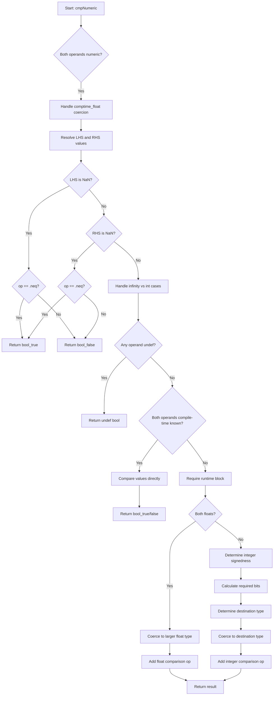

好的，我现在需要为给定的Zig函数`cmpNumeric`绘制一个流程图。首先，我需要仔细阅读并理解这个函数的逻辑结构。这个函数的作用是比较两个数值类型的操作数，处理各种类型转换和特殊情况，比如编译时浮点数、整数边界、NaN值、无穷大比较等。

首先，函数开始时会检查两个操作数的类型是否都是数值类型。然后处理一些特殊情况，比如当其中一个操作数是编译时浮点数（comptime_float）而另一个是固定宽度浮点数时，会进行类型强制转换。接着，尝试解析两个操作数的值，看是否为常量，这样可以进行编译时的优化。

接下来，函数会处理一些可能的编译时确定的结果。例如，如果其中一个值是NaN，那么根据操作符直接返回true或false。同样，如果涉及无穷大和整数的比较，也会直接返回结果，不需要运行时计算。

然后，函数检查是否有操作数是未定义的（undef），如果有的话，结果也是未定义的。如果两个操作数都是编译时已知的常量，那么直接比较它们的值并返回结果。

如果无法在编译时确定结果，函数会生成运行时代码。根据操作数的类型（浮点数或整数），选择合适的类型进行转换，并生成相应的比较指令。

在处理整数比较时，函数会考虑符号和位数，决定目标类型，并进行必要的类型转换。对于混合符号或不同位数的整数，选择足够大的类型来避免溢出。对于浮点数和整数的混合比较，会提取浮点数的整数部分并进行调整，然后转换为合适的整数类型进行比较。

整个流程中需要考虑多种边界情况和类型转换规则，确保比较操作的正确性。现在需要将这些逻辑步骤转化为流程图的结构，使用条件判断、处理块和连接线来表示不同的执行路径。

可能的流程图结构如下：
1. 开始：输入参数。
2. 检查操作数类型是否为数值类型。
3. 处理comptime_float到固定浮点的转换。
4. 解析操作数值（可能为常量）。
5. 处理NaN情况。
6. 处理无穷大与整数的比较。
7. 检查是否有undef，返回undef结果。
8. 如果都是常量，直接比较返回结果。
9. 否则，生成运行时代码。
10. 根据类型选择浮点或整数比较路径。
11. 处理类型转换，生成比较指令。
12. 返回结果。

需要确保所有条件分支都被覆盖，并且流程图中的每个判断点都有明确的Yes/No路径。同时，注意循环或递归结构，但在这个函数中似乎没有循环，主要是条件分支。

在绘制时，可能需要将复杂的条件拆分为多个判断节点，确保流程清晰。例如，处理NaN、无穷大、undef等情况的判断应作为独立的分支。此外，处理类型转换和生成运行时代码的部分可能需要进一步的子流程分解。

最后，验证流程图的正确性，确保所有可能的执行路径都被正确表示，没有遗漏任何条件或处理步骤。
================================================

该流程图展示了`cmpNumeric`函数的主要逻辑路径：
1. 类型校验和comptime_float的特殊处理
2. NaN和无穷大的快速判断
3. 未定义值和编译时常量的处理
4. 运行时值的类型转换策略（浮点优先->整数位宽处理）
5. 最终比较指令的生成
关键决策点用菱形表示，操作步骤用矩形表示，最终结果通过不同路径汇聚到统一的输出节点。