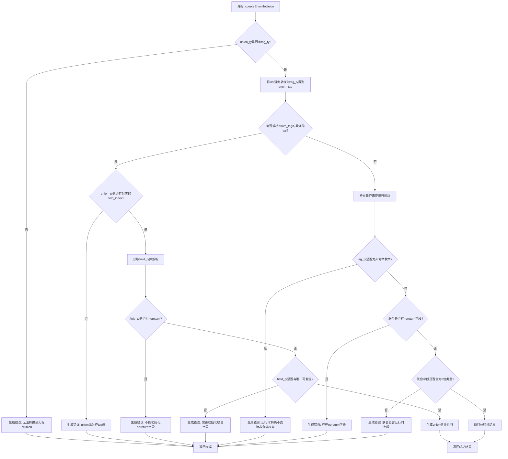

好的，我需要为给定的Zig函数`coerceEnumToUnion`绘制一个流程图。首先，我需要理解这个函数的主要逻辑和各个分支。

首先，函数接收一些参数，包括Sema、Block、类型信息等。主要目的是将枚举类型强制转换为联合类型。函数开始时检查联合类型是否有标签类型，如果没有，则返回错误。接着，尝试将输入的实例强制转换为标签类型，如果成功，继续检查是否存在对应的字段索引，如果不存在则报错。然后检查字段类型是否为noreturn，如果是则报错。接下来，检查字段类型是否有唯一可能的值，如果没有，则要求运行时块，并进行其他检查，比如是否为非穷举枚举，是否有noreturn字段等。最后，处理特殊情况，如所有字段都是零位类型，或者返回错误信息。

接下来，我需要将这些步骤转化为流程图的结构。流程图的开始是函数入口，然后按照条件分支逐步展开。需要注意错误处理部分，每个错误条件都需要一个分支，并最终指向错误节点。成功路径则继续执行直到返回结果。

可能需要将复杂的条件判断分解为多个菱形判断框，例如检查tag_ty是否存在，检查val是否存在，检查字段类型是否为noreturn等。同时，需要注意循环结构，比如遍历联合类型的字段检查是否有noreturn字段的部分，这在流程图中可能需要表示为循环结构，但可能简化为一个判断，因为实际代码中使用了循环。

最后，整理所有判断和操作步骤，确保每个可能的执行路径都被覆盖，并用适当的图形表示（如矩形表示操作，菱形表示判断，箭头表示流程方向）。需要确保错误处理和正常流程都清晰可见。
================================================

流程说明：
1. 首先检查目标联合类型是否带有标签类型，无标签直接报错
2. 强制类型转换后，如果能确定枚举的具体值：
   - 检查联合是否有对应的字段
   - 验证字段类型有效性（禁止noreturn）
   - 检查字段是否需要显式初始化
3. 如果无法确定枚举值（需要运行时处理）：
   - 检查非穷举枚举限制
   - 扫描联合是否存在noreturn字段
   - 处理全零位字段的特殊情况
4. 所有错误路径最终汇集到错误返回节点
5. 成功路径通过类型检查后返回构造好的联合值