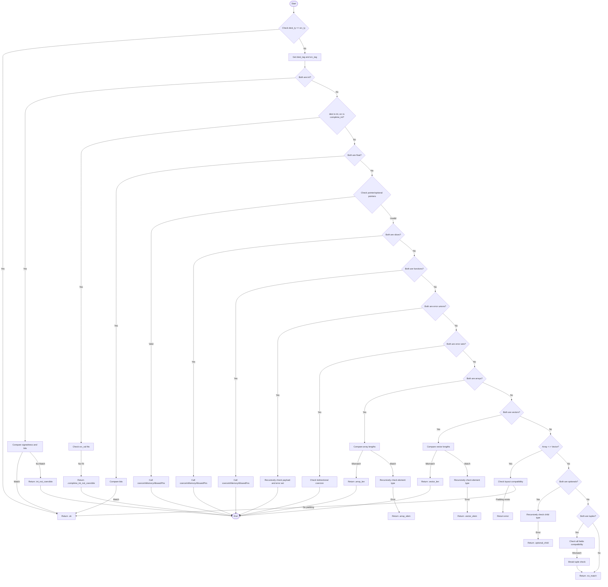

嗯，我现在需要帮用户用Mermaid画出他们提供的Zig函数`coerceInMemoryAllowed`的流程图。首先，我得仔细看一下这个函数的代码，理解它的逻辑结构。这个函数的作用是检查两种类型是否可以在内存中强制转换，对吧？看起来有很多条件判断，处理不同类型的情况，比如整数、浮点数、指针、数组、错误联合体等等。

首先，我应该先通读整个函数，理清主要的判断分支。函数开始比较目标类型和源类型是否相等，如果相等就直接返回.ok。然后检查它们的类型标签，比如是否是整数、浮点数、指针、切片、函数等。每种类型都有不同的处理逻辑，比如整数会检查符号和位数，浮点数检查位数，指针和切片需要进一步处理子类型，错误联合体需要检查负载类型和错误集合等等。

接下来，我需要确定如何将这些条件分支转化为流程图的结构。Mermaid的流程图语法支持条件判断、子流程等结构。每个条件判断对应一个菱形节点，不同的分支处理不同的情况，最终可能返回不同的结果。

需要注意的是，这个函数中有递归调用，比如处理数组元素类型、错误联合体的负载类型等。这时候流程图可能需要子流程或者分解成多个部分，但为了简洁，可能需要在主流程中表示递归调用的情况，或者用注释说明。

另外，函数中有很多返回不同结果的路径，比如返回.int_not_coercible、.array_len等等。每个条件分支下可能返回不同的错误类型或者.ok，这些都需要在流程图中体现出来。

可能的步骤是：

1. 开始节点：函数开始。
2. 检查dest_ty和src_ty是否相等，是的话返回.ok。
3. 获取dest_tag和src_tag。
4. 处理整数类型：检查符号和位数，满足条件返回.ok，否则返回错误。
5. 处理编译时整数到普通整数：如果有值且不符合，返回错误。
6. 处理浮点数：位数相同返回.ok。
7. 处理指针和可选指针，调用coerceInMemoryAllowedPtrs。
8. 处理切片，同样调用coerceInMemoryAllowedPtrs。
9. 处理函数，调用coerceInMemoryAllowedFns。
10. 处理错误联合体，递归检查负载和错误集合。
11. 处理错误集合，检查是否允许双向转换。
12. 处理数组，检查长度、元素类型、哨兵值。
13. 处理向量，检查长度和元素类型。
14. 处理数组与向量之间的转换，检查长度、元素类型、填充位。
15. 处理可选类型，检查子类型是否兼容。
16. 处理元组，逐个字段检查。
17. 如果以上都不匹配，返回.no_match。

每个步骤都需要在流程图中表示为一个节点或判断分支。递归调用可能需要简化表示，比如用子流程节点。

此外，有些步骤可能包含多个条件，比如处理整数时有多个条件判断，这时候需要分多个判断节点。例如，先检查是否是整数类型，然后比较符号和位数，如果不符，再检查其他可能的条件组合，最后返回相应的错误。

需要注意的是，流程图的布局要清晰，避免交叉线太多。可能需要将一些复杂的判断拆分为多个步骤，或者使用子图来组织代码块。

现在，我需要将这些逻辑转化为Mermaid语法。每个条件判断用菱形，处理步骤用矩形，返回结果用椭圆形或菱形。递归调用可以用子程序节点，或者直接写出函数调用名。

例如，处理指针的部分会调用coerceInMemoryAllowedPtrs，这可能是一个子流程，但在主流程中可以表示为调用该函数，然后返回结果。

同样，处理错误联合体时，递归调用coerceInMemoryAllowed检查负载类型，这也需要在流程图中表示出来。

可能的结构如下：

开始 -> 检查类型相等？是的话返回ok
否的话获取dest_tag和src_tag
然后根据不同的类型标签进入不同的处理分支，每个分支处理完后返回相应的结果。

每个分支处理完后，如果没有返回，继续后续的分支检查，直到所有可能性都覆盖，最后返回no_match。

需要注意的是，代码中的条件判断顺序会影响流程图的路径。例如，先处理整数，然后浮点，指针等，所以流程图需要按照同样的顺序排列条件分支。

可能遇到的困难是代码中有很多嵌套的条件判断，需要正确映射到流程图的节点中，同时保持可读性。此外，处理递归调用时如何表示可能需要简化，比如用“处理子类型”这样的节点，而不用展开整个子流程。

最终，我需要确保流程图覆盖了所有主要的条件分支，并且结构清晰，用户能够通过流程图理解函数的执行逻辑。
================================================

这个流程图：
1. 按代码逻辑顺序处理不同类型
2. 用菱形表示条件判断
3. 矩形框表示操作/函数调用
4. 椭圆形表示返回结果
5. 处理递归检查时用"Recursively check..."标注
6. 包含了所有主要错误返回路径
7. 用注释形式简化了复杂的数据结构比较
8. 保持与原始代码相同的判断顺序

对于特别复杂的子流程（如指针检查），用单独的函数调用框表示，保持主流程图的可读性。递归检查用简化的"Recursively check..."标注，避免流程图过于复杂。