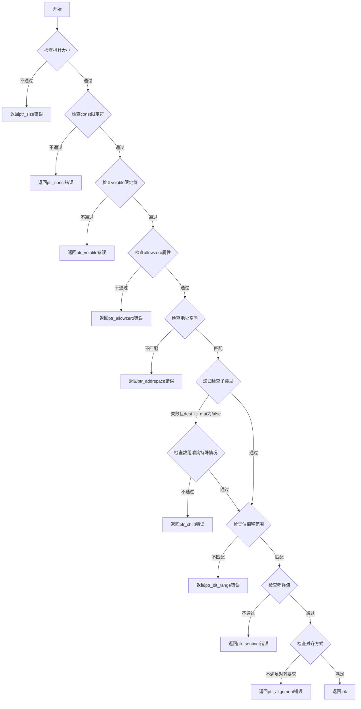

嗯，用户让我用Mermaid画出一个Zig函数的流程图。首先，我需要仔细阅读并理解这个函数的逻辑。这个函数的名字是`coerceInMemoryAllowedPtrs`，看起来是用来检查指针类型在内存中是否允许强制转换的。函数接收多个参数，包括源类型和目标类型的指针信息，然后进行一系列的条件检查。

首先，我需要明确函数的结构。函数开始部分获取了`dest_ptr_ty`和`src_ptr_ty`的指针信息，然后进行多个条件判断，比如指针大小、const限定符、volatile限定符、allowzero属性、地址空间、子类型兼容性、位偏移、哨兵值以及对齐等。每个条件不满足时都会返回不同的错误结果，如果所有条件都满足，最后返回`.ok`。

接下来，我需要将这些条件判断转化为流程图中的决策节点。每个条件检查都是一个判断框，根据是否满足条件，流程会走向不同的分支。例如，检查指针大小是否合适，如果不合适，返回`ptr_size`错误；否则继续下一步。

需要注意的是，有些条件检查之间有依赖关系。例如，在检查子类型兼容性时，如果子类型检查失败，并且`dest_is_mut`为false，那么需要进一步检查是否属于特殊情况（比如数组的哨兵值）。这可能需要一个嵌套的判断结构。

此外，函数中有一些复杂的逻辑，比如处理子类型的递归调用`sema.coerceInMemoryAllowed`，这里可能需要简化，因为流程图需要保持清晰。可能只需要表示为一个子流程或者调用另一个函数。

在绘制流程图时，需要确保所有的返回路径都被覆盖，包括各种错误情况和最终的`.ok`。每个判断节点应该有两个分支：满足条件和不满足条件。不满足条件的分支指向对应的错误返回，满足条件的分支继续下一个检查。

最后，对齐检查部分也涉及多个条件，比如对齐值的比较方式（等于或不等于，大于等）。需要正确反映这些逻辑关系。

可能遇到的挑战是如何将嵌套的条件判断和递归调用简化为线性流程，同时保持逻辑的准确性。需要仔细验证每一步的条件和返回结果，确保流程图正确反映代码的执行路径。
================================================

流程说明：
1. 按顺序检查指针的元属性：大小、const、volatile、allowzero、地址空间
2. 递归检查子类型兼容性，若失败则尝试哨兵数组特殊规则
3. 检查位偏移、哨兵值、对齐方式等底层细节
4. 全部条件满足时返回成功，任一环节失败立即返回具体错误类型
5. 特殊处理数组哨兵规则允许`*[n:s]T`到`*[n]T`的转换
6. 对齐检查区分显式声明对齐和ABI推导对齐的混合场景