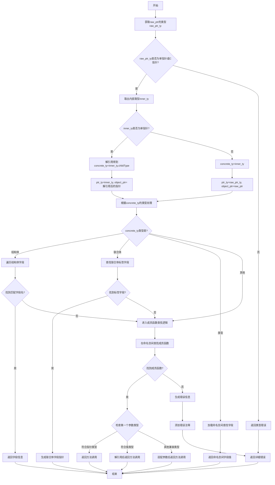

好的，我需要帮用户用Mermaid画出给定Zig函数`fieldCallBind`的流程图。首先，我需要仔细阅读并理解这个函数的逻辑。

首先，函数`fieldCallBind`的作用是处理结构体或联合体字段的访问或成员函数的调用。它接收一个指针，然后根据字段名找到对应的字段或方法，并返回相应的结果或错误。

接下来，我需要分解函数的步骤：

1. **获取指针类型和内部类型**：检查`raw_ptr`的类型，如果是单指针或C指针，取出其内部类型`inner_ty`。如果不是，返回错误。

2. **处理双重指针**：如果内部类型本身也是指针，则进一步解引用，得到具体的类型`concrete_ty`，并调整指针类型`ptr_ty`和对象指针`object_ptr`。

3. **查找字段**：根据`concrete_ty`的类型（结构体、联合体、类型等）进行不同的处理：
   - **结构体**：检查是否有匹配的字段名，若找到则返回对应的字段信息。
   - **联合体**：查找标签类型中的字段名，处理对应的指针。
   - **类型**：加载命名空间并查找字段值。
   - 其他情况继续后续处理。

4. **查找成员函数**：如果在结构体中未找到字段，尝试在命名空间中查找成员函数。检查函数的第一个参数类型是否符合当前类型的指针或值，决定如何传递参数。

5. **错误处理**：如果未找到字段或合适的成员函数，生成详细的错误信息，包括可能的建议（如使用`try`、`catch`、`if`，或解引用指针）。

在绘制流程图时，需要将这些步骤转化为决策节点、操作节点和分支。例如，判断指针类型是否为指针、是否双重指针、结构体是否有字段、是否找到成员函数等，每个判断都有不同的分支路径，直到最终返回结果或错误。

需要注意的是，函数中有多个条件分支和循环（如遍历结构体字段），需要用合适的流程图结构表示。同时，错误处理部分需要包含多个可能的错误提示，这些可以作为不同的结束节点。

最后，使用Mermaid的语法将这些步骤组织成流程图，确保逻辑清晰，节点和分支正确对应函数的执行流程。
================================================
