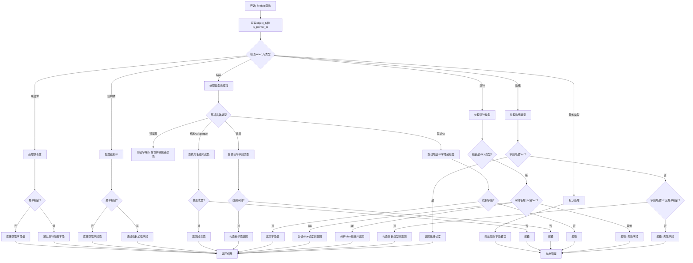

嗯，我需要为这个Zig函数`fieldVal`画一个流程图。首先，我得仔细阅读代码，理解它的逻辑结构。这个函数的主要作用是根据给定的对象和字段名，获取对应的字段值。看起来它处理了多种类型，比如数组、指针、结构体、联合体等。

首先，函数开始的时候，它获取了一些参数，比如`sema`, `block`, `src`, `object`, `field_name`等。然后检查对象类型是否是单指针，如果是，就获取其内部类型。接下来根据内部类型的不同，进行不同的处理。

比如，当内部类型是数组时，检查字段名是否是`len`或`ptr`，如果是的话，返回相应的值。否则报错。对于指针类型，如果是slice，处理`ptr`和`len`字段。对于类型为`type`的情况，进一步处理错误集、联合体、枚举、结构体等。结构体和联合体部分，如果是指针，则通过指针获取字段值，否则直接获取。

我需要将这些逻辑分支用流程图表示出来。可能需要从开始到各个类型判断，然后每个判断下的处理步骤，包括返回或错误处理。需要注意的是，代码中有多个switch和if-else结构，需要正确映射到流程图的各个节点。

比如，流程图的开始节点是函数入口，然后判断`inner_ty`的类型，进入不同的分支。每个分支内部可能有进一步的判断，比如字段名的比较，是否是指针等。每个处理步骤后可能有返回结果或抛出错误。

在画流程图时，要确保每个条件判断都有两个分支（是/否），并且每个分支最终指向结果或下一个判断。对于复杂的嵌套结构，可能需要分层处理，避免线条过于混乱。

另外，要注意代码中的一些递归调用，比如调用`structFieldVal`或`unionFieldVal`，这些可能需要在流程图中用子流程或单独节点表示。不过，由于是高级流程图，可能不需要展开这些函数内部细节，只需标明调用即可。

最后，错误处理部分，比如调用`sema.fail`或`failWithBadMemberAccess`，这些应该作为流程图的终止节点，表示错误返回。

总结一下，流程图的大致结构可能是：

1. 开始
2. 检查对象类型是否为指针，获取inner_ty
3. 根据inner_ty的类型进入不同的处理分支（数组、指针、类型、结构体、联合体等）
4. 每个分支内部处理字段名，返回对应值或错误
5. 结束节点（返回结果或错误）

需要确保所有可能的路径都被覆盖，包括各种错误情况。
================================================
