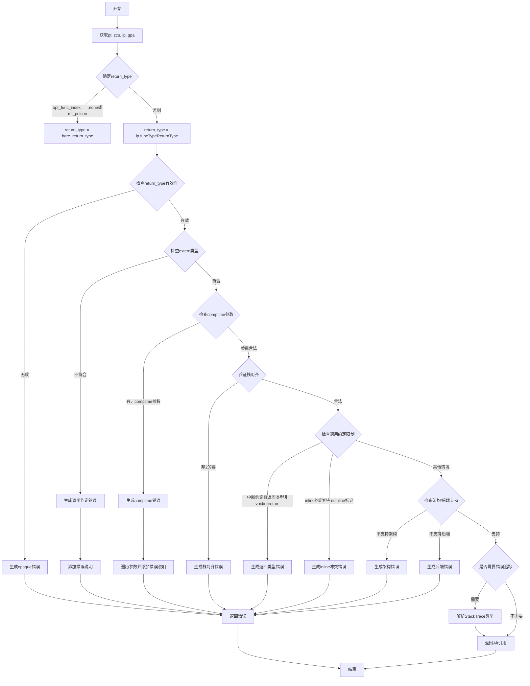

好的，我需要为提供的Zig函数`finishFunc`绘制一个流程图。首先，我会仔细阅读代码，理解每个步骤的作用和逻辑分支。这个函数主要负责完成函数的语义分析，包括返回类型检查、调用约定验证等。

首先，函数开头获取了一些上下文变量，如`pt`, `zcu`, `ip`, `gpa`。然后根据`opt_func_index`是否存在或`ret_poison`是否为真，确定返回类型`return_type`。

接下来有几个主要的检查：
1. **返回类型有效性检查**：如果返回类型无效（比如是opaque类型），则报错。
2. **外部类型验证**：对于非Zig调用约定的函数，验证返回类型是否符合外部类型要求。
3. **comptime参数检查**：如果返回类型需要在编译时确定，但参数不是comptime，则报错。
4. **栈对齐验证**：检查调用约定的栈对齐是否是2的幂。
5. **特定调用约定的返回类型限制**：例如，中断处理函数必须返回`void`或`noreturn`。
6. **调用约定支持的架构和后端检查**：确认当前架构和编译器后端是否支持该调用约定。
7. **错误追踪处理**：如果需要错误追踪，确保`StackTrace`类型的字段已解析。

最后，函数返回一个`Air.Inst.Ref`，根据`opt_func_index`是否存在决定使用哪个值。

在绘制流程图时，我需要将这些步骤按顺序排列，并用条件分支表示各个检查点。每个条件判断（如if语句）对应一个菱形节点，处理逻辑对应矩形节点，错误处理对应不同的路径。同时，需要注意循环结构，比如在检查所有参数是否为comptime时的循环。

需要确保流程图的逻辑清晰，每个判断和处理步骤都正确映射到代码中的结构。可能还需要处理错误消息的生成和返回路径。最后，将所有这些元素用Mermaid语法组织起来，形成完整的流程图。
================================================
