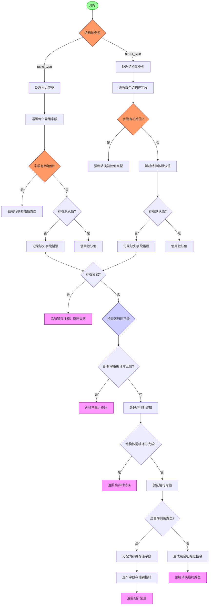

好的，我需要为给定的 Zig 函数 `finishStructInit` 绘制一个流程图。首先，我应该通读代码，理解其逻辑结构。函数的主要目的是完成结构体或元组的初始化，处理字段的初始化值，并进行类型检查和错误处理。

首先，函数接收多个参数，包括 Sema、Block、各种位置信息、字段初始值数组、结构体类型等。接下来，函数根据结构体类型是元组还是普通结构体分别处理。

对于元组类型，遍历每个字段，检查是否有初始值。如果有，进行类型强制转换；如果没有，检查是否有默认值，否则报错。对于结构体类型，类似的处理，但需要处理字段名和默认初始化值。

在处理完所有字段后，检查是否有错误消息，如果有，添加注释并返回错误。然后检查是否有运行时字段，如果没有，创建常量并返回。如果有运行时字段，处理可能的编译时错误，验证运行时值，并根据是否是引用类型处理内存分配和指针操作，最后返回初始化后的结构体。

接下来，我需要将这些步骤转化为流程图。流程图应包括开始、判断结构体类型（元组或结构体）、遍历每个字段、处理初始值或默认值、错误处理、检查运行时字段、处理引用类型等步骤，以及可能的结束点。

需要注意的是，流程图中需要处理条件分支，例如结构体类型的不同处理，字段是否有初始值，是否存在错误消息，是否所有字段都是编译时已知等。同时，错误处理部分可能涉及生成错误消息并提前返回。

可能遇到的困难是如何将复杂的逻辑分支清晰地表达在流程图中，特别是嵌套的条件判断和循环遍历字段。需要确保每个判断节点都有明确的是/否分支，并且循环部分用适当的方式表示，例如在流程图中用循环框或注释说明遍历过程。

最后，确保流程图覆盖所有主要的代码路径，包括正常情况和错误情况，以及处理引用类型时的不同逻辑。
================================================

流程图说明：
1. 开始后首先判断结构体类型（元组/普通结构体）
2. 针对不同类型分别处理字段初始化：
   - 检查每个字段是否有显式初始值（强制类型转换）
   - 无显式值时检查默认值，否则记录错误
3. 收集所有错误后：
   - 存在错误时添加注释并返回失败
   - 无错误时检查是否存在运行时字段
4. 根据是否全编译时字段：
   - 全编译时：创建常量
   - 存在运行时字段：
     - 检查是否需要编译时完成（报错）
     - 验证运行时值后处理引用类型逻辑
5. 最终根据不同路径返回指针常量或聚合初始化结果