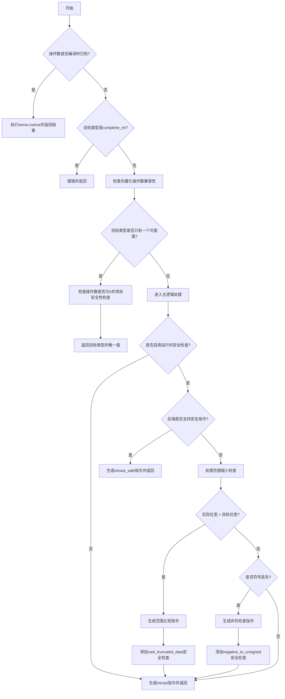

嗯，我需要为这个Zig函数`intCast`画一个流程图。首先，我得仔细阅读代码，理解它的逻辑结构。这个函数看起来处理整数类型转换，包括编译时和运行时的检查，以及各种安全性的处理。

首先，函数开始部分检查操作数是否是编译时已知的。如果是的话，直接进行类型强制转换。如果不是，接着检查目标类型是否是`comptime_int`，如果是的话会报错，因为运行时值不能转换为`comptime_int`。

接下来，函数检查向量化的操作数是否兼容。然后处理目标类型只有一个可能值的情况，比如转换为`u0`类型，这时候需要确保操作数为0，并可能添加运行时安全检查。

然后，函数进入主逻辑，处理运行时的安全性检查。这里分为不同的情况：目标类型是否支持安全指令，是否需要检查范围缩小，以及有符号转无符号时的非负检查。对于范围缩小的情况，根据操作数和目标类型的位宽和符号，生成相应的比较和安全性检查。对于有符号转无符号的情况，检查操作数是否非负。

最后，根据是否支持安全指令，生成不同的指令，或者直接进行类型转换。

我需要将这些步骤转化为流程图。可能需要从开始到各个条件分支，比如是否编译时已知、目标类型是否是comptime_int、是否单一值类型，然后处理各种运行时检查的情况。每个条件分支下可能有不同的操作，比如添加安全性检查、生成错误或返回结果。

需要注意的是，流程图中要正确表示条件判断和循环结构，比如if-else分支，以及可能的错误处理路径。同时，要区分编译时和运行时的不同处理路径，以及不同安全性设置下的行为。

可能会有一些复杂的嵌套条件，比如在处理范围缩小时，又分为向量和非向量的情况，需要正确分层表示。此外，函数中的多个返回点也需要在流程图中体现出来，比如直接返回结果、返回错误或生成指令后返回。

可能需要多次梳理代码逻辑，确保每个条件分支和操作步骤都被正确映射到流程图的节点和边。同时，使用合适的符号表示判断节点、操作节点、结束节点等，保持流程图的清晰和易读。
================================================

该流程图主要展示以下关键路径：
1. 编译时已知值的快速路径
2. 目标类型有效性检查
3. 单值类型特殊处理
4. 安全检查主逻辑：
   - 直接使用后端安全指令
   - 手动实现范围检查（位宽缩小）
   - 符号丢失检查（有符号转无符号）
5. 最终指令生成路径

各个安全检查节点都通过菱形判断框进行分支，最终汇聚到intcast指令生成节点，保持了Zig安全优先的设计哲学。