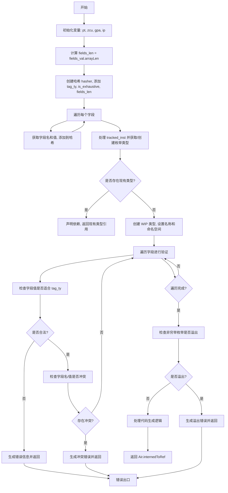

好的，我需要为这个Zig函数`reifyEnum`绘制一个流程图。首先，我得理解这个函数的功能和结构。看起来这个函数是用来处理枚举类型的重新实例化或者验证的。函数参数包括Sema（语义分析）、块、指令索引、源位置、标签类型、是否穷举、字段值和命名策略等。

首先，函数开始初始化一些变量，比如`pt`、`zcu`、`gpa`和`ip`。然后计算字段长度`fields_len`，接着使用Wyhash创建一个哈希，用于后续的类型去重。哈希内容包括标签类型、是否穷举、字段数量以及每个字段的名称和值。

接下来，处理`tracked_inst`并尝试获取或创建枚举类型。如果已经存在，就直接返回现有类型的引用；否则，创建一个新的WIP（Work In Progress）类型。这里涉及到错误处理，如果中途失败需要取消WIP类型。

然后设置WIP类型的名称，创建新的命名空间，并声明依赖关系。之后，遍历所有字段，检查每个字段的值是否符合标签类型的整数范围，如果有重复的名称或值，会生成相应的错误信息。

最后，如果是非穷举枚举且字段数量超过标签类型的位数，会报错。之后处理代码生成的相关逻辑，根据配置决定是否使用LLVM，并返回最终的Air指令引用。

现在需要将这些步骤转化为流程图。流程图的步骤大致如下：

1. 初始化变量和计算字段长度。
2. 创建哈希并遍历字段生成哈希值。
3. 检查是否存在现有类型，存在则返回。
4. 创建WIP类型，设置名称和命名空间。
5. 遍历字段，验证名称和值是否合法。
6. 检查非穷举枚举的字段数量是否溢出。
7. 处理代码生成，返回结果。

需要注意错误处理的分支，比如在字段验证失败时的错误返回，以及WIP类型的取消。此外，循环遍历字段的部分需要表示循环结构。

可能需要使用条件判断（菱形框）、循环（循环框）、步骤（矩形框）以及错误处理（箭头指向错误出口）。

这样一步步分解后，就可以用Mermaid语法画出流程图了。确保每个主要步骤和条件分支都被正确表示，并保持逻辑顺序。
================================================
