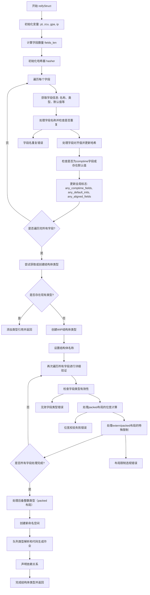

好的，我需要为提供的Zig函数`reifyStruct`绘制一个流程图。首先，我需要理解这个函数的主要步骤和逻辑结构。这个函数似乎负责将结构体类型具体化，处理各种字段、布局、默认值等。

首先，我会通读代码，识别主要的步骤和条件分支。例如，函数开始处理字段信息，验证字段名称是否重复，处理不同的布局类型（如extern、packed），计算哈希用于去重，处理默认值和编译时字段等。接着，会涉及到结构体类型的创建和配置，包括字段类型、对齐方式、默认值等。最后，处理与代码生成相关的内容，如队列作业和依赖声明。

接下来，我需要将这些步骤转化为流程图的各个节点和判断分支。例如：

1. 初始化变量，如字段长度、哈希生成器。
2. 遍历所有字段，收集每个字段的信息，并进行哈希计算。
3. 检查是否有重复的字段名称。
4. 处理不同的布局类型（extern、packed、auto），验证字段类型是否符合布局要求。
5. 处理默认值和编译时字段的验证。
6. 创建或获取现有的结构体类型，配置其属性。
7. 处理打包结构体的位宽和后备整数类型。
8. 创建命名空间，队列相关作业，声明依赖，返回结果。

在绘制流程图时，需要注意条件判断的分支，比如是否已有现有类型、字段是否重复、布局类型的不同处理等。同时，错误处理路径（如返回错误信息）也需要在流程图中体现。

可能需要将复杂的循环（如遍历字段）简化为一个循环节点，内部包含详细的处理步骤。另外，确保流程图的逻辑顺序与代码执行顺序一致，避免遗漏关键步骤。

最后，根据这些分析，使用Mermaid语法构建流程图，确保节点和箭头正确表示函数的执行流程和条件分支。
================================================
