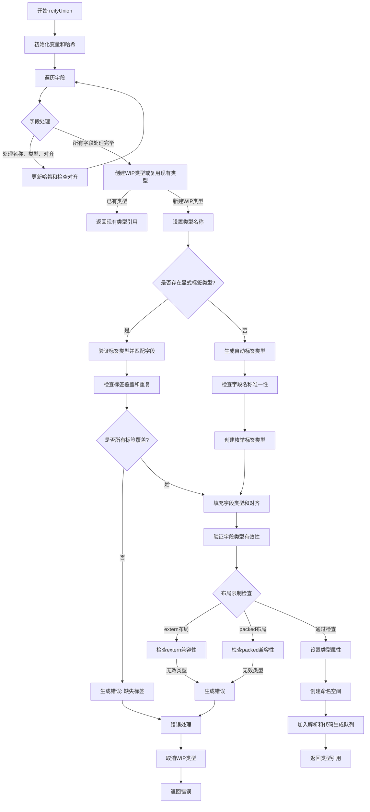

好的，我需要为给定的Zig函数`reifyUnion`绘制一个流程图。首先，我需要理解这个函数的主要逻辑步骤，然后将这些步骤转化为流程图中的各个节点和分支。

首先，函数`reifyUnion`的作用似乎是处理联合类型（union type）的具体化（reify）。它接收多个参数，包括语义分析器（sema）、块（block）、指令索引（inst）、源位置（src）、布局（layout）、可选标签类型（opt_tag_type_val）、字段值（fields_val）和命名策略（name_strategy）。

从代码结构来看，函数的大致流程如下：

1. **初始化变量和哈希计算**：初始化一些变量，计算哈希值用于后续的类型去重。
2. **遍历字段并处理**：遍历所有字段，处理每个字段的名称、类型和对齐方式，同时更新哈希和检查对齐。
3. **处理类型标签**：根据是否存在显式的标签类型（opt_tag_type_val），分为两种情况处理：
   - 有显式标签类型：验证每个字段是否在标签类型中存在，并检查重复。
   - 无显式标签类型：自动生成标签类型，并确保字段名称唯一。
4. **验证字段类型**：检查每个字段类型的有效性，包括是否允许在特定布局（extern、packed）中使用。
5. **设置联合类型属性**：将处理后的字段类型、对齐方式、标签类型等设置到联合类型中。
6. **创建命名空间和队列任务**：创建新的命名空间，并将类型解析和代码生成任务加入队列。
7. **返回结果**：完成所有处理后，返回生成的联合类型的引用。

在绘制流程图时，需要注意条件分支，例如是否有显式标签类型、布局类型是否为extern或packed等。此外，错误处理（如字段重复、无效对齐值等）也需要在流程图中体现为错误节点。

可能的遗漏或需要进一步确认的细节：
- 函数中的`errdefer`处理，确保在错误发生时回滚操作。
- `wip_ty`的处理，包括创建、取消、完成等步骤。
- 生成标签类型的具体逻辑，可能需要更详细的子流程。

最终，流程图应该从函数入口开始，按照逻辑顺序逐步展开各个步骤，并在条件判断处分出不同的分支，直到最终返回结果或处理错误。
================================================
