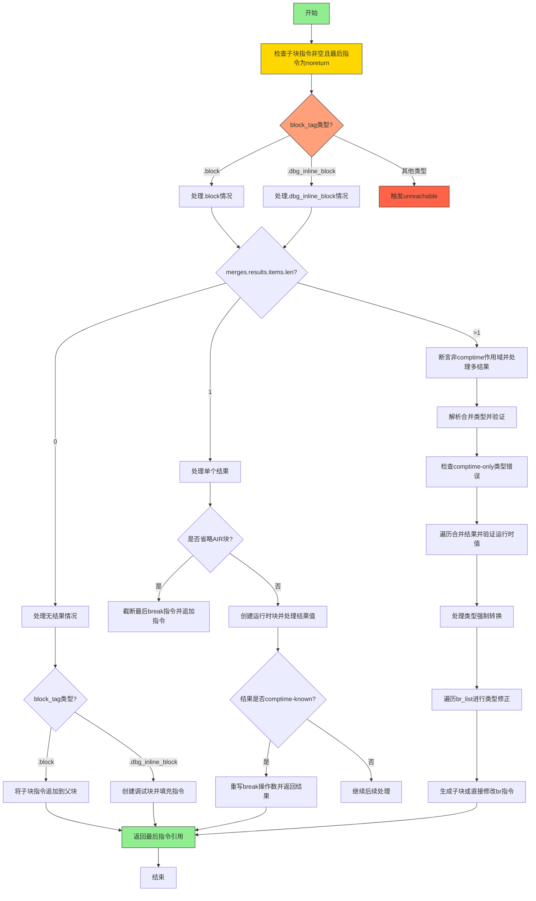

好的，我现在需要为提供的Zig函数`resolveAnalyzedBlock`绘制一个流程图。首先，我需要理解这个函数的结构和逻辑。这个函数主要负责处理块（block）的解析和合并，涉及到不同的块类型（如.block和.dbg_inline_block），以及处理不同类型的合并结果。函数中有多个条件判断和分支，需要将这些逻辑转化为流程图。

首先，我会通读整个函数，识别主要的步骤和条件分支。例如，函数开始时检查子块是否有指令，并确保最后一个指令是noreturn类型。接着，根据`block_tag`的不同（如.block或.dbg_inline_block）处理不同的情况。然后，根据`merges.results.items`的长度（0、1或多个）进行不同的处理。特别是当结果为1时，还可能有进一步的判断，比如是否需要调试作用域，以及是否可以省略AIR块。

接下来，我需要将这些条件分支和步骤转化为流程图的节点和判断框。例如：

1. 开始节点。
2. 检查子块是否有指令，且最后一个指令是noreturn。
3. 根据`block_tag`进行分支：.block、.dbg_inline_block或其他（unreachable）。
4. 如果`merges.results.items.len == 0`，处理不同block_tag的情况。
5. 如果`merges.results.items.len == 1`，进一步检查是否省略AIR块，或处理运行时块。
6. 当结果超过1时，断言不在comptime作用域中，处理类型解析和验证。
7. 处理类型强制转换，修改break指令等。

需要注意的是，流程图中每个条件判断后会有不同的路径，需要正确连接各个节点。此外，循环结构（例如处理每个`merges.br_list.items`中的br指令）也需要用循环结构表示。

在绘制过程中，可能会遇到一些复杂的嵌套条件，需要合理拆分步骤，确保流程图清晰易懂。例如，当`merges.results.items.len == 1`时，内部的多个判断可能需要多个判断框。此外，错误处理和资源释放（如`defer tracy.end()`）可能也需要在流程图中体现，但根据代码内容，这部分可能属于跟踪调试，不影响主流程，可以简化或省略。

最后，需要确认流程图的完整性和准确性，确保所有主要路径都被覆盖，没有遗漏重要的条件分支或步骤。同时，使用合适的符号（如矩形表示步骤，菱形表示判断）来区分不同类型的节点，使流程图结构清晰。
================================================

流程说明：
1. 函数入口校验基本块属性
2. 根据块类型（block/dbg_inline_block）分流处理
3. 根据合并结果数量分三种处理路径：
   - 无结果：直接合并指令或创建调试块
   - 单结果：尝试优化或创建运行时块
   - 多结果：处理类型验证和运行时控制流
4. 完成类型强制转换后最终返回块引用
5. 红色节点表示不可达路径，黄色为校验节点，绿色为开始/结束节点