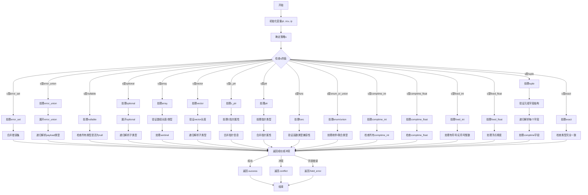

好的，我需要为给定的Zig函数`resolvePeerTypesInner`绘制一个流程图。首先，我需要理解这个函数的功能和结构。这个函数似乎是用于解析多个类型（peer types）的共同类型，处理不同的策略，比如错误集合、指针、数组、元组等。

首先，我会通读代码，识别主要的控制流结构。函数开始于初始化一些变量，然后根据不同的`PeerResolveStrategy`进入不同的处理分支。每个分支处理不同类型的解析逻辑，例如错误集合、指针、数组等。每个分支内部可能有循环、条件判断以及递归调用。

接下来，我需要确定各个分支之间的逻辑关系。例如，函数首先确定策略`s`，然后根据不同的策略进入不同的`switch`分支。每个分支处理完自己的逻辑后，可能会递归调用`resolvePeerTypesInner`来处理子类型，或者直接返回结果。

在绘制流程图时，需要注意以下几点：
1. 函数入口和出口。
2. 主要的条件判断（如`switch (s)`）。
3. 每个策略分支的处理流程，包括循环、条件判断、递归调用。
4. 错误处理和返回冲突的情况。

可能遇到的挑战包括：
- 处理复杂的递归调用，需要明确递归的触发条件和返回路径。
- 多个策略分支之间的独立性或依赖性。
- 确保流程图的层次结构清晰，避免交叉线过多。

为了简化流程，可以将每个策略分支作为一个子流程，用子图表示。同时，使用条件判断节点和循环节点来表现代码中的逻辑结构。递归调用可以用单独的节点表示，并指向函数入口。

最后，需要验证流程图是否覆盖了所有代码路径，确保没有遗漏重要的逻辑分支。
================================================
