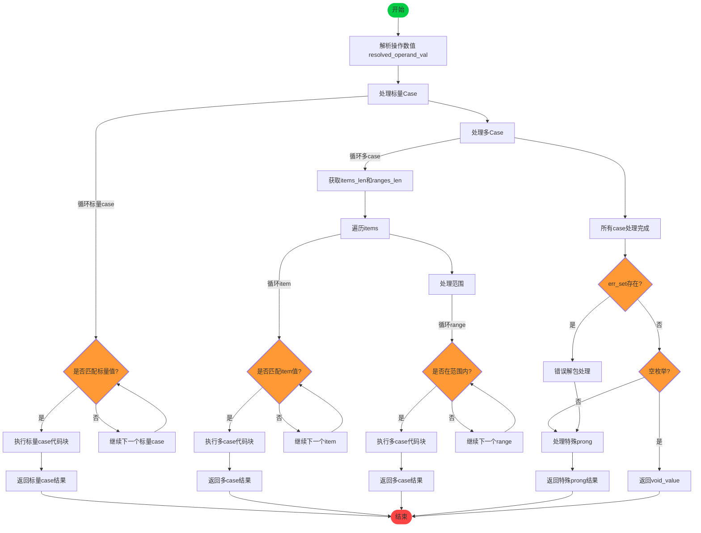

好的，我需要为给定的 Zig 函数 `resolveSwitchComptime` 绘制一个流程图。首先，我需要仔细阅读并理解这个函数的结构和逻辑。这个函数的主要功能是处理编译时的 switch 语句分析，根据不同的条件分支执行相应的代码。

首先，函数接收多个参数，包括 Sema 结构体指针、SwitchProngAnalysis、子块、条件操作数等。然后，它解析操作数的值，并根据不同的 case 类型（标量 case 和多 case）进行处理。

接下来，函数分为两个主要部分：处理标量 case 和处理多 case。每个标量 case 会检查是否匹配操作数的值，如果匹配则执行对应的代码块。多 case 处理包括多个项和范围检查，同样进行值比较，并在匹配时执行对应的代码。

在处理完所有 case 后，如果有错误集合或空枚举的情况，函数会进行相应的处理，最后返回特殊 prong 的结果。

现在，我需要将这些逻辑步骤转化为流程图。流程图应包括开始和结束节点，条件判断（菱形框），处理标量 case 和多 case 的循环，以及可能的错误处理和返回路径。

需要注意的是，标量 case 部分有一个 while 循环，遍历所有标量 case；多 case 部分有一个 while 循环，处理每个多 case，内部还有循环处理范围和项。此外，在处理多 case 时，需要遍历多个项和范围，进行值比较。

在绘制流程图时，应确保每个循环和条件分支都正确表示，并且流程的顺序与代码逻辑一致。需要特别注意循环的退出条件和各部分的连接。

最后，检查是否有遗漏的逻辑分支，例如错误处理和特殊情况的返回，确保流程图全面且准确反映函数的执行流程。
================================================
