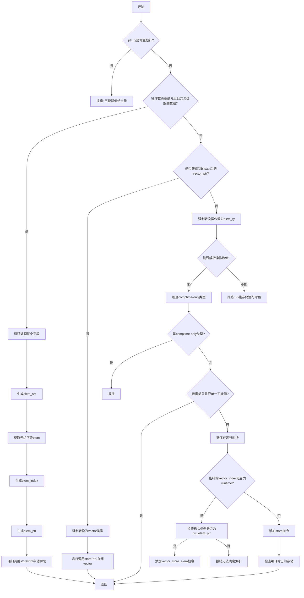

嗯，用户让我用Mermaid画出一个Zig函数的流程图。首先，我需要理解这个函数的逻辑。函数名是storePtr2，看起来是关于存储指针操作的，可能涉及到类型检查和不同的存储情况处理。

首先，我会通读代码，看看函数的主要步骤。函数开头检查指针类型是否为常量，如果是，返回错误。接着处理元组类型的情况，逐个字段进行存储。然后处理向量指针的位转换情况，将数组转换为向量存储。之后进行类型强制转换，处理可能的编译时值。接下来检查运行时存储是否需要处理comptime-only类型，以及是否有单一可能值的情况。最后处理运行时块和向量元素索引的情况，添加相应的指令。

接下来，我需要将这些步骤分解成流程图中的各个节点。每个条件判断（如if语句）会形成分支，循环（如while）可能需要一个循环节点。但Mermaid的流程图语法不支持循环节点，可能需要用条件判断来模拟。

需要注意的是，代码中有多个条件分支，比如检查operand_ty是否为元组，elem_ty是否为数组，还有处理位转换后的向量指针的情况。每个分支处理完后可能返回或继续执行后续步骤。

另外，函数中有递归调用storePtr2，比如在处理元组字段时循环调用自身。这部分在流程图中需要体现，但可能需要简化，避免过于复杂。

可能的流程步骤：

1. 检查指针是否为常量，如果是，报错。
2. 处理元组类型，逐个字段存储。
3. 处理向量指针的位转换，存储向量。
4. 类型强制转换，处理可能的错误。
5. 检查运行时存储和comptime-only类型。
6. 处理单一可能值的情况。
7. 确保运行时块。
8. 处理向量元素索引，添加相应指令。
9. 添加存储指令，检查编译时已知的存储。

需要将这些步骤用条件判断连接起来，确保逻辑正确。同时注意错误处理和递归调用的情况。

现在，我需要用Mermaid语法将这些步骤结构化。使用菱形表示条件判断，矩形表示操作，箭头连接流程。注意代码中的返回点，每个return对应流程的结束分支。

可能的结构：

开始 -> 检查指针常量 -> 是？报错结束
检查指针常量 -> 否 -> 处理元组情况 -> 是？循环存储字段 -> 结束
处理元组情况 -> 否 -> 处理向量指针 -> 是？存储向量 -> 结束
处理向量指针 -> 否 -> 类型强制转换 -> 检查操作数值 -> 处理编译时存储或运行时
处理运行时 -> 检查comptime-only类型 -> 报错或继续
检查单一可能值 -> 是？结束
否则 -> 确保运行时块 -> 处理向量元素索引 -> 添加指令 -> 结束

递归调用storePtr2的部分可能需要简化为一个子流程，或者用单独的节点表示。

需要确保每个分支都覆盖，并且逻辑正确。可能有些条件嵌套较深，需要分层次处理。

最后，生成Mermaid代码，用正确的语法表示这些步骤，注意缩进和箭头方向。
================================================

该流程图描述了以下关键路径：
1. 首先检查指针常量性，错误则直接返回
2. 处理元组类型时的字段展开存储逻辑
3. 处理向量指针的位转换存储路径
4. 主路径的类型强制转换和值解析
5. 运行时存储的各种校验（comptime-only类型、单一值类型等）
6. 最终生成不同的存储指令（向量元素存储/普通存储）
7. 始终以错误处理或正常返回结束流程

递归调用通过「递归调用storePtr2」节点体现，实际绘制时可视为子流程调用。菱形节点表示条件分支，矩形节点表示操作步骤。