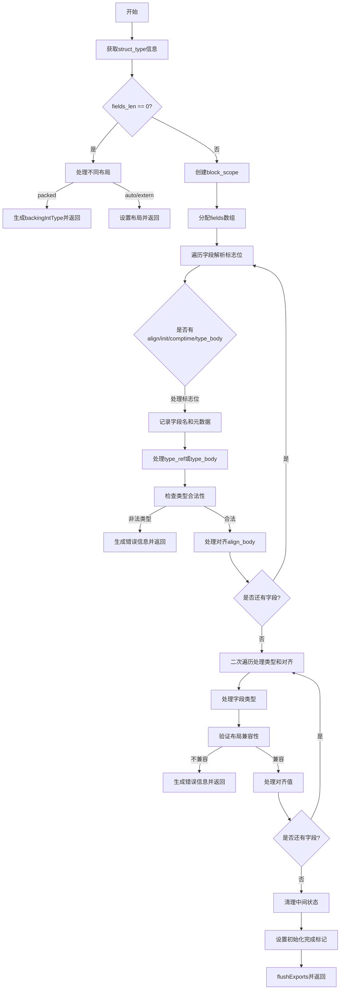

嗯，我需要帮用户把提供的Zig代码中的`structFields`函数用Mermaid画出流程图。首先，我得先仔细阅读代码，理解它的逻辑结构。看起来这个函数主要是处理结构体的字段，包括类型、对齐和初始化值。代码中有很多条件判断和循环，所以流程图可能会比较复杂。

首先，函数开始时会获取一些结构体的基本信息，比如字段长度。然后根据不同的结构体布局（packed、auto、extern）处理不同的情况。接下来，创建一个块作用域（block_scope），并分配内存来存储字段信息。之后，遍历每个字段，处理类型、对齐和初始化的相关内容。其中，有些字段可能有类型体、对齐体或初始化体，需要分别处理。最后，进行一些清理工作，比如清除字段类型的中间状态和检查是否有初始化值。

在画流程图的时候，应该从函数的入口开始，逐步画出各个步骤。需要注意条件判断的分支，比如处理不同布局的switch语句，以及循环遍历字段的部分。每个条件判断都会产生不同的流程路径，需要正确表示出来。此外，错误处理和返回的位置也需要在流程图中体现。

可能遇到的挑战是如何将复杂的逻辑结构简化为清晰的流程图节点和箭头，同时不遗漏重要的步骤。需要确保每个判断点都有对应的分支，循环结构正确表示，并且各个处理步骤有序排列。另外，代码中有一些错误处理的部分，比如返回错误或记录错误信息，这些也需要在流程图中标注出来。

最后，生成Mermaid代码时，要使用正确的语法，比如开始和结束的标记，节点之间的连接箭头，以及条件判断的分支标签。可能需要使用不同的形状来表示不同的节点类型，比如矩形表示处理步骤，菱形表示判断条件，椭圆形表示开始和结束等。
================================================
