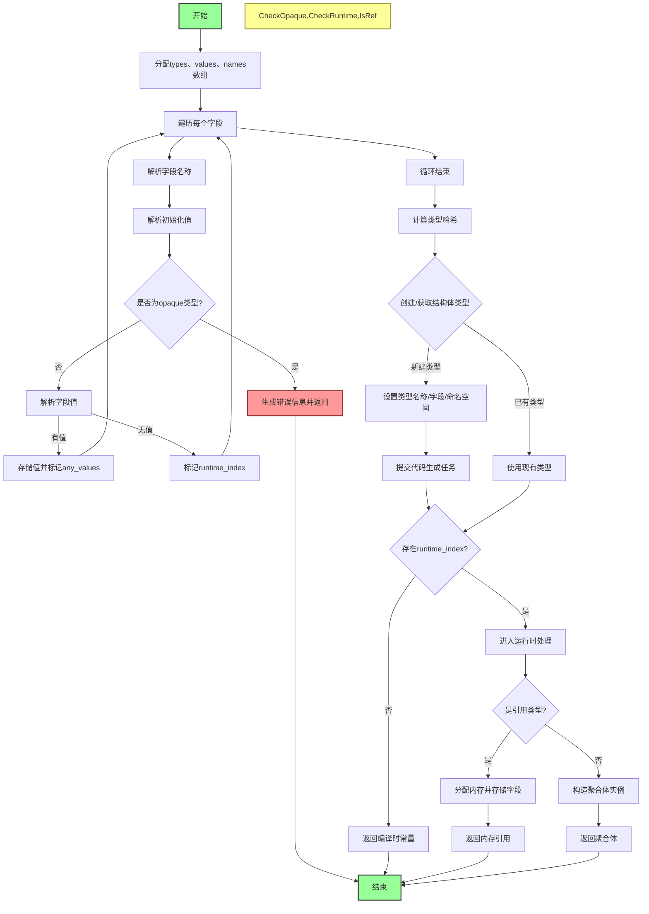

好的，我需要为提供的Zig函数`structInitAnon`绘制一个流程图。首先，我得仔细阅读代码，理解它的结构和逻辑流程。

函数的目标是初始化一个匿名或类型化的结构体。看起来它处理两种不同的初始化方式，可能在编译时或运行时处理不同的情况。代码中有许多条件判断和循环，比如处理字段类型、名称和初始值。

首先，函数开始时会分配内存来存储字段的类型、值和名称。然后，它会遍历每个字段，解析字段的名称和初始化值。这里有一个循环，处理每个字段的信息，可能涉及到错误处理，比如遇到不透明类型时会报错。

接下来，函数计算类型的哈希值，用于确定结构体类型。然后，根据是否已经有现有的类型或需要创建新的类型来处理结构体的创建。这里涉及到一些复杂的逻辑，比如创建新的命名空间、处理代码生成任务等。

之后，函数检查是否存在需要运行时处理的字段。如果所有字段都在编译时确定，就直接返回常量结构体。否则，进入运行时处理逻辑，分配内存并设置每个字段的值，最后返回结构体的引用或直接构造结构体实例。

在绘制流程图时，需要将这些步骤分解成不同的节点，并按照执行顺序连接起来。需要注意条件分支，比如是否存在运行时字段、是否引用类型等，这些会导致不同的处理路径。同时，错误处理的部分也需要在流程图中体现，比如遇到不透明类型时的错误返回。

可能需要将整个流程分为几个主要部分：初始化阶段、字段处理阶段、类型哈希计算、结构体类型处理（新建或现有）、运行时检查、以及根据是否引用类型处理不同的生成逻辑。每个部分内部又有详细的步骤，比如循环处理每个字段，解析名称和值，处理错误等。

最后，确保流程图清晰展示各个步骤之间的顺序和条件分支，使用合适的形状表示开始/结束、过程、判断点等。可能还需要注释说明关键步骤，比如哈希计算、类型创建、错误处理等，以增强可读性。
================================================

该流程图的关键路径说明：
1. 初始化阶段分配内存存储字段元信息
2. 循环处理每个字段的解析和验证
3. 通过哈希判断结构体类型是否需要新建
4. 根据是否存在运行时字段选择处理路径
5. 最终根据不同条件返回常量、引用或聚合体
6. 错误处理路径贯穿整个过程
7. 黄色菱形表示关键判断点，绿色节点表示开始/结束，红色节点表示错误路径