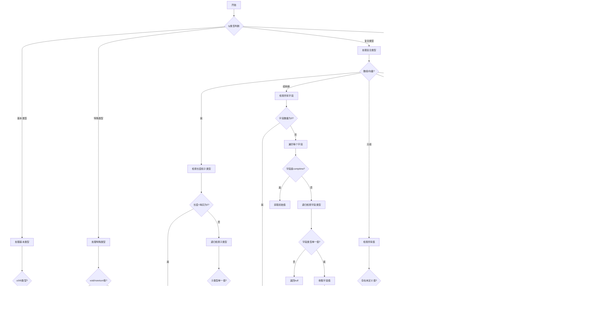

好的，我需要帮用户用Mermaid画出这个Zig函数的流程图。首先，我需要仔细阅读并理解这个函数的逻辑。

函数名是`typeHasOnePossibleValue`，看起来是判断某个类型是否只有一个可能的取值，并返回该值或者null。函数接受一个类型`ty`，然后通过switch语句处理不同的类型情况。

首先，函数处理一些基本类型，比如u0、i0，返回0；其他如u8、i8等返回null。然后处理void、noreturn等特殊类型，返回对应的Value。接着处理数组、结构体、元组、联合体、枚举等复合类型，递归检查它们的子类型是否都只有一个可能的值。

接下来，我需要将整个函数的逻辑分解成不同的流程块。可能的结构是：

1. 开始
2. 检查ty的类型
3. 对于基本类型，直接返回对应的值或null
4. 对于复合类型（数组、结构体等），递归检查子类型
5. 处理复合类型的各个情况，比如数组长度是否为0，子类型是否单一值
6. 对于结构体，检查每个字段是否都是单一值
7. 对于联合体，检查标签和值类型是否单一
8. 对于枚举，根据不同的tag模式处理
9. 最终返回结果或null

需要注意的是递归调用的情况，比如处理数组的子类型，结构体的字段类型等。同时，有些情况会直接触发unreachable，比如处理anyframe_type。

在画流程图时，需要将这些判断分支用条件框表示，处理操作用矩形框，递归调用可能需要子流程。由于代码较长，可能需要分块处理，避免过于复杂。

另外，代码中有很多switch和嵌套的switch，需要理清每个分支的条件。比如外层switch处理ty.toIntern()的各种情况，内层再根据不同的tag处理。

可能需要将整个流程分成几个主要部分：

- 处理简单类型（直接返回）
- 处理复合类型（数组、结构体等）
- 处理枚举和联合体
- 处理错误情况（unreachable）

每个部分再细分条件分支。例如，处理数组时，检查长度和子类型；结构体检查字段是否都是comptime或有单一值等。

最后，确保所有可能的路径都被覆盖，并且流程图能清晰展示逻辑走向，包括递归的部分。
================================================

流程图说明：
1. 开始后首先进行类型分类判断
2. 基本类型直接处理返回0或null
3. 特殊类型（void/noreturn等）返回对应预定义值
4. 复合类型处理分为数组、结构体、元组、联合体、枚举等子流程
5. 数组/向量需要检查长度和子类型的单一值性
6. 结构体递归检查所有字段的单一值性
7. 元组需要确保所有值都已定义
8. 联合体需要同时检查标签类型和值类型的单一性
9. 枚举类型根据不同tag模式进行不同处理
10. 所有分支最终汇聚到结束节点
11. 无效路径会触发unreachable