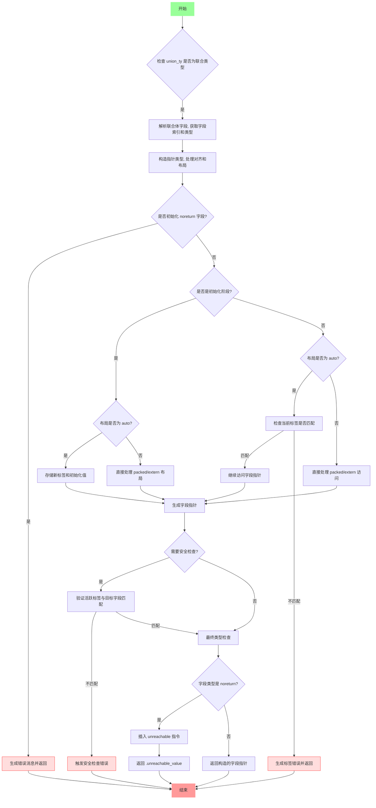

嗯，我需要为这个Zig函数`unionFieldPtr`画一个流程图。首先，我得理解这个函数的功能。看起来这个函数处理联合体（union）的字段指针，可能涉及类型检查、错误处理以及内存操作。

首先，函数开始时会进行一些断言和初始化操作，比如检查`union_ty`是否是联合类型。然后获取联合体指针的类型信息，解析字段，找到对应的字段索引和类型。接下来处理指针类型，考虑对齐和布局（比如auto、packed、extern）。

然后，有错误处理的情况，比如当初始化一个`noreturn`类型的字段时，会生成错误消息。接着处理运行时的情况，比如在自动布局的联合体中初始化或访问字段时，检查标签是否匹配，否则报错。

还有安全检查的部分，当不是初始化且布局为auto时，检查当前活跃的标签是否与目标字段匹配。最后，根据字段类型返回相应的指针或触发不可达代码。

我需要把这些步骤分解成流程图中的各个节点，包括条件判断（比如是否是初始化阶段、布局类型、安全检查是否通过等），以及每个分支的处理过程。同时要注意错误处理的路径，比如生成错误消息并返回错误。

可能的结构是：

1. 开始
2. 检查union_ty是否为联合类型
3. 解析字段，获取字段索引和类型
4. 处理指针类型和对齐
5. 检查是否在初始化noreturn字段，是则报错
6. 处理初始化或访问时的标签检查
   - 如果是初始化，处理标签设置
   - 如果是访问，检查标签是否匹配
7. 处理packed/extern布局的情况
8. 进行安全检查和标签验证
9. 根据字段类型返回指针或unreachable

需要将这些步骤用条件判断连接起来，确保流程正确反映代码逻辑。
================================================
