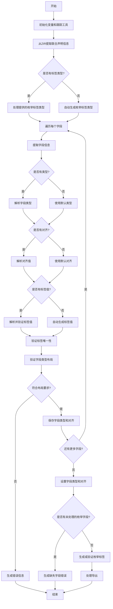

好的，我需要为提供的Zig函数`unionFields`绘制一个流程图。首先，我需要理解这个函数的功能和结构。这个函数似乎是处理联合类型的字段，包括类型检查、对齐处理、标签生成等。

首先，函数开始时会初始化一些变量和跟踪工具。接着，从ZIR（Zig Intermediate Representation）中提取联合声明相关的信息，比如操作码、标签类型、捕获长度等。然后，根据是否有标签类型，处理不同的情况：自动生成枚举标签或使用提供的枚举类型。在处理每个字段时，会检查类型、对齐、标签是否存在，并验证字段是否符合布局要求（如extern或packed）。最后，设置字段类型和对齐，并处理枚举标签的生成和验证。

接下来，我需要将这些步骤转化为流程图。流程图应该包括主要的分支和循环，例如处理每个字段的循环、条件判断是否有标签类型、不同类型的错误处理等。需要注意函数中的错误处理部分，如返回错误信息的情况。

可能的结构：
1. 开始
2. 初始化变量和跟踪
3. 从ZIR提取联合声明信息
4. 处理标签类型（自动生成或使用提供的枚举）
5. 遍历每个字段：
   a. 提取字段信息
   b. 处理类型、对齐、标签
   c. 验证字段类型是否符合布局
6. 设置字段类型和对齐
7. 生成或验证枚举标签
8. 处理错误情况
9. 结束

需要注意条件分支，例如是否有标签类型、是否有对齐字段、不同类型的布局检查等。此外，循环处理每个字段的部分需要明确表示。

现在，我需要将这些步骤用Mermaid语法表示出来，确保逻辑清晰，分支正确。
================================================
