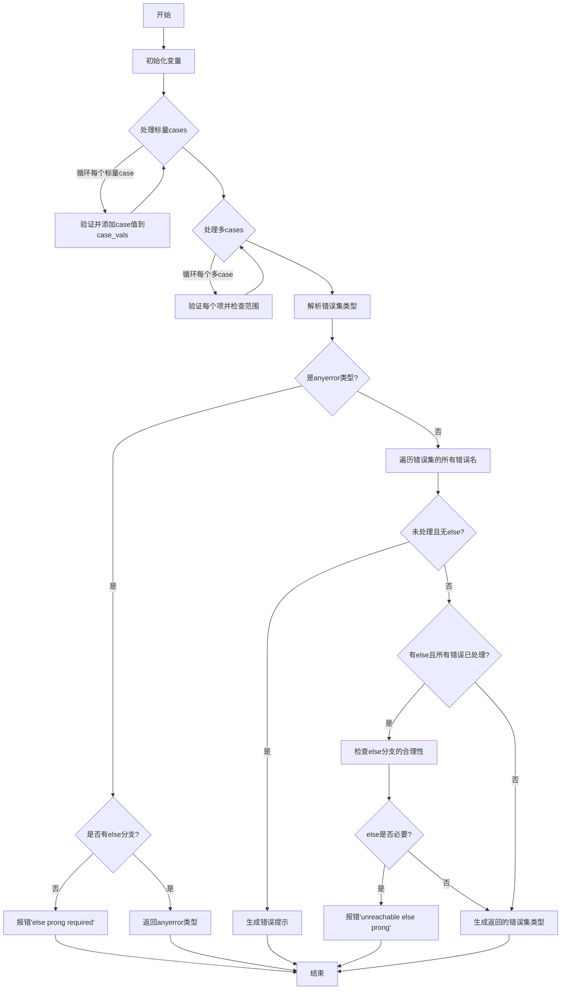

好的，我需要为提供的Zig函数`validateErrSetSwitch`画一个流程图。首先，我要理解这个函数的结构和逻辑流程。

函数的主要目的是验证错误集开关（switch）是否处理了所有可能的错误情况。看起来它处理两种类型的case：标量（scalar）和多个（multi），然后检查是否有未处理的错误，如果有的话会生成相应的错误信息。

首先，我会通读代码，理清各个部分的作用：

1. **初始化部分**：获取一些上下文变量，如`gpa`、`pt`、`zcu`、`ip`等，以及设置源节点信息。
2. **处理标量cases**：通过循环遍历每个标量case，验证每个case的值，并添加到`case_vals`列表中。
3. **处理多cases**：同样循环处理多个case，可能包含多个项和范围，验证每个项并检查是否有范围（如果有则报错）。
4. **错误集类型解析**：根据`operand_ty`解析推断的错误集类型，如果是`anyerror`类型且没有else分支，报错。
5. **检查未处理的错误**：遍历错误集中的每个错误名，如果未被处理且无else分支，生成错误提示。
6. **处理else分支**：如果有else分支，但所有错误已被处理，检查else分支是否有必要，如果存在无效的else则报错。
7. **返回错误集类型**：生成并返回正确的错误集类型。

接下来，我需要将这些步骤转化为流程图的节点和判断条件。可能的步骤包括：

- 开始
- 初始化变量
- 处理标量cases
- 处理多cases
- 解析错误集类型
- 是否是anyerror类型？
  - 是：检查是否有else分支，没有则报错
  - 否：继续检查未处理的错误
- 遍历错误名，收集未处理的错误
- 是否存在未处理的错误且无else分支？
  - 是：生成错误信息
  - 否：继续
- 检查else分支是否必要（所有错误已处理）
  - 是：验证else分支的合理性，若无效则报错
- 生成最终的返回类型

需要注意条件分支和循环结构，比如处理标量和多cases时的循环，以及遍历错误名的循环。此外，错误处理部分需要多个条件判断，例如是否有else分支、是否所有错误都被处理等。

可能遇到的挑战是如何正确表示循环和嵌套的条件判断，确保流程图清晰易懂。使用Mermaid的语法，需要合理使用子图（subgraph）来表示循环和条件块，但Mermaid的subgraph支持有限，可能需要简化结构，用注释或分组来区分不同的处理阶段。

最终，流程图应涵盖函数的主要逻辑路径，包括错误处理路径，并正确反映函数的控制流。
================================================
