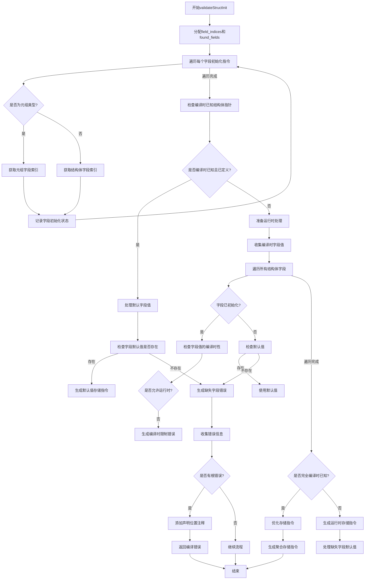

好的，我现在需要帮助用户将Zig语言中的`validateStructInit`函数转换为Mermaid流程图。首先，我需要仔细阅读并理解这个函数的逻辑。这个函数的主要目的是验证结构体的初始化，处理字段的默认值、错误检查以及编译时的优化。

首先，我会通读整个函数，确定主要的步骤和分支。函数开始时分配了一些内存，然后检查每个字段的初始化情况。接着处理默认值，检查是否有缺失的字段，并生成相应的错误消息。然后，函数处理运行时和编译时的不同情况，包括结构体的内存布局和存储指令的生成。

接下来，我需要将这些步骤分解成流程图中的各个节点。可能的节点包括初始化变量、遍历字段、检查默认值、处理错误、处理编译时和运行时的不同路径等。同时，需要考虑条件分支，例如字段是否存在默认值、是否为元组类型、是否在编译时已知等。

在分解过程中，需要特别注意错误处理的部分，例如当字段缺失且没有默认值时，生成错误消息。此外，处理编译时和运行时的不同逻辑也是关键，这会影响最终的存储指令生成方式。

可能会出现一些复杂的情况，例如循环遍历字段、动态分配内存后的释放，以及多个条件判断。需要确保这些逻辑在流程图中清晰表达，避免遗漏任何重要的步骤。

最后，将所有这些步骤和条件用Mermaid的语法组织起来，确保流程图的逻辑正确，结构清晰，便于理解。可能需要多次调整节点顺序和连接，以准确反映函数的执行流程。
================================================
