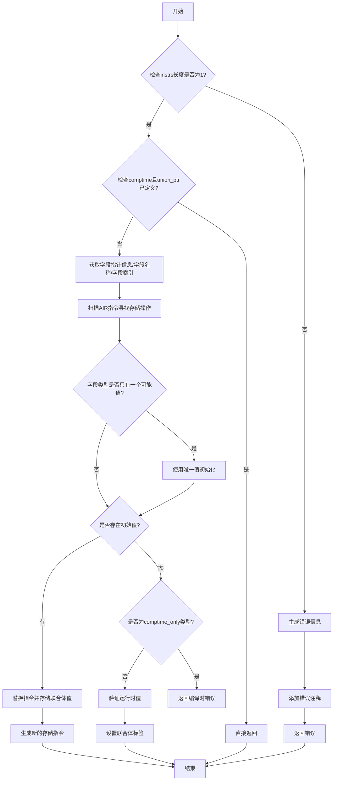

嗯，我需要为这个Zig函数`validateUnionInit`画一个流程图。首先，我得理解这个函数是做什么的。看起来它是用来验证联合体（union）的初始化的。函数的主要逻辑包括检查初始化指令的数量，处理编译时已知的情况，确定字段索引，以及生成相应的AIR指令。

首先，函数开始时会检查`instrs`的长度是否为1。如果不是，就生成错误信息，指出联合体不能同时初始化多个字段。这一步应该对应流程图中的一个判断框，如果长度不等于1，进入错误处理流程，添加错误消息和相关注释，然后返回错误。

接下来，如果是编译时（comptime）并且`union_ptr`有定义的值，就直接返回，不需要做其他处理。这里需要判断`block.isComptime()`和`resolveDefinedValue`的结果，成立的话直接结束流程。

然后获取第一个字段指针的信息，包括字段名称和索引。这里可能需要处理字段不存在的情况，调用`unionFieldIndex`可能会抛出错误，需要捕获。

之后，函数会检查当前块的AIR指令，寻找存储指令（store），确定是否需要替换为编译时已知的值。这部分逻辑比较复杂，涉及循环遍历块中的指令，判断指令类型，可能需要调整块的指令索引。

如果字段类型只有一个可能的值，直接使用该值。然后根据是否有初始化值`init_val`，决定是否替换指令或处理编译时错误。如果有`init_val`，删除相关的`field_ptr`和`store`指令，插入新的存储指令。否则，检查是否需要在运行时验证值，并设置联合体的标签。

在画流程图时，需要将这些步骤分解为判断和操作节点，注意错误处理和不同路径的分支。比如，错误处理部分可能需要多个步骤生成错误消息，添加注释，然后返回错误。而处理编译时已知值的情况则可能直接结束流程。

需要确保每个条件判断都有对应的分支，如`instrs.len !=1`、`block.isComptime()`、`init_val`是否存在等。同时，循环遍历指令块的部分可能需要用循环结构表示，但流程图应简化关键步骤，避免过于复杂。

可能遗漏的细节包括`try`操作可能引发的错误处理，但流程图可能不需要显示所有可能的错误路径，只需主要逻辑。另外，函数中涉及的类型检查和AIR指令操作需要适当抽象，以保持流程图的可读性。

总结下来，流程图的大致结构应该是：

1. 开始
2. 检查instrs长度是否为1 → 否 → 生成错误，返回错误
3. 是 → 检查是否在comptime且union_ptr有值 → 是 → 结束
4. 否 → 获取字段信息，确定字段索引
5. 遍历块指令，寻找存储指令，确定初始值
6. 检查字段类型是否只有一个可能值 → 是 → 使用该值
7. 判断是否有初始值 → 有 → 替换指令，存储联合体值
8. 无 → 检查是否comptime_only → 是 → 返回错误
9. 否 → 验证运行时值，设置标签
10. 结束

需要注意各步骤之间的连接和条件分支，确保逻辑正确。
================================================

流程说明：
1. 首先检查初始化指令数量，若不为1则生成详细的嵌套错误信息
2. 在comptime上下文中直接复用已有值时提前退出
3. 解析字段元数据后，通过逆向扫描AIR指令定位初始化操作
4. 对字段类型特殊处理（如零大小类型）
5. 根据是否找到编译时值选择指令替换或运行时验证路径
6. 最终统一处理标签设置和存储操作