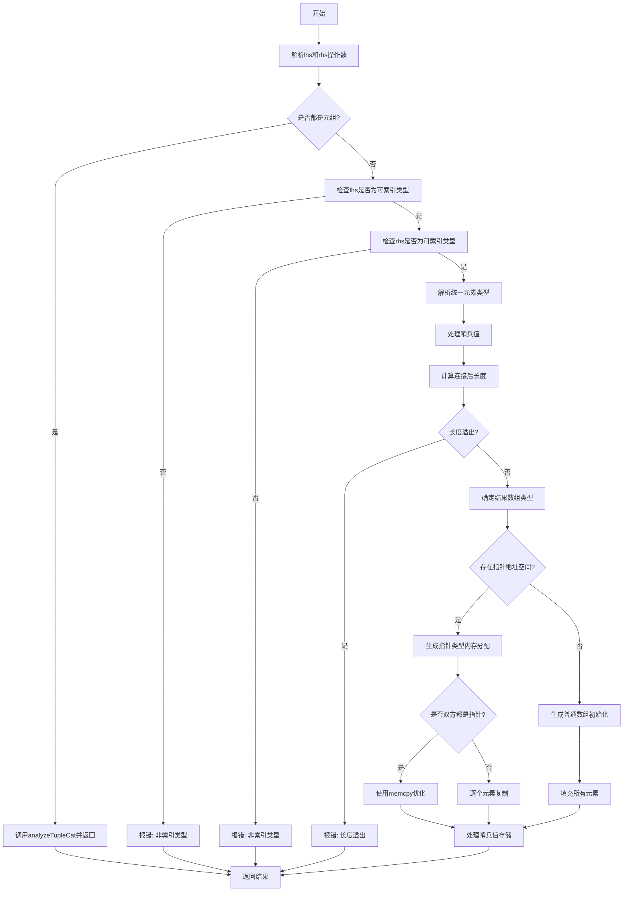

嗯，我现在需要根据提供的Zig代码中的`zirArrayCat`函数来画一个流程图。首先，我得先理解这个函数的功能和结构。看起来这个函数是用来处理数组连接的，可能是将两个数组或元组合并成一个新的数组。函数内部有很多条件判断和错误处理，还有处理不同类型的元素和指针的情况。

首先，我需要理清函数的主要步骤。函数开始时解析左右操作数，检查它们的类型是否是元组。如果是元组，就调用`analyzeTupleCat`。否则，继续检查是否是可索引的类型，获取数组连接的信息。然后处理元素类型的一致性，计算结果数组的长度，处理哨兵值（sentinel），最后根据情况生成常量或运行时代码来构建新数组。

接下来，我需要将这些步骤转化为流程图的节点和判断分支。可能的流程如下：

1. 开始：进入函数。
2. 解析左右操作数（lhs和rhs）。
3. 检查lhs和rhs是否都是元组，如果是，调用analyzeTupleCat并返回。
4. 如果不是，检查lhs和rhs是否为可索引类型，否则报错。
5. 解析元素类型，确定统一的元素类型。
6. 处理哨兵值，检查是否存在冲突。
7. 计算连接后的数组长度，处理溢出错误。
8. 确定结果数组的类型。
9. 判断是否有指针地址空间，处理不同情况（常量或运行时分配）。
10. 如果是运行时分配，生成相应的内存操作（如memcpy）或逐个元素赋值。
11. 最后返回构建的数组。

在这个过程中，每一步都可能出现错误，需要错误处理节点。例如，当数组长度相加溢出时，会返回错误。还有类型不匹配时的错误提示。

另外，代码中有很多条件分支，比如检查lhs和rhs是否为元组、是否有哨兵值、是否是指针类型等，这些都需要在流程图中用判断节点表示。

可能需要将代码分成几个主要部分：初始化、类型检查、元素类型解析、长度计算、内存分配与赋值、返回结果。每个部分内部的条件分支需要详细展开。

需要注意的是，流程图中要展示各个判断点（菱形符号），以及对应的处理路径。例如，判断lhs和rhs是否都是元组，如果是，走一个分支；否则继续后续检查。同样，处理哨兵值时，如果有冲突则舍弃哨兵，否则保留。

最后，生成数组的部分分为两种情况：常量情况下直接构造，运行时情况下可能使用memcpy或逐个元素复制，并处理哨兵值的存储。

可能需要多次迭代来确保所有条件分支都被覆盖，并且流程图准确地反映代码的逻辑流程。
================================================

该流程图展示以下关键路径：
1. 元组处理的快速路径
2. 类型校验失败路径
3. 动态内存分配路径（含memcpy优化和逐元素复制）
4. 静态初始化路径
5. 错误处理路径（类型不匹配/长度溢出）
菱形节点表示条件判断，矩形节点表示操作步骤，六边形表示错误处理。