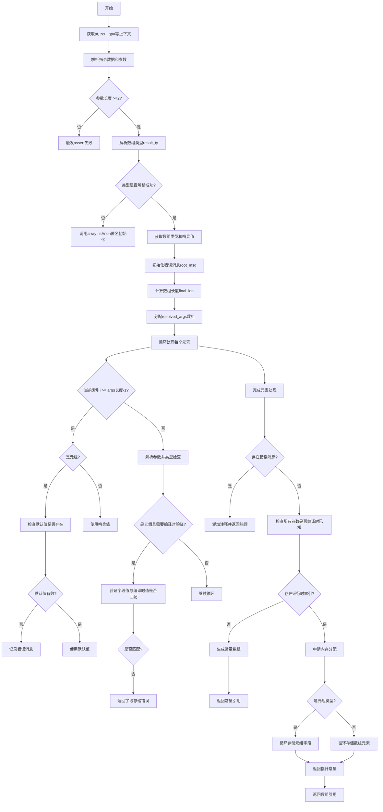

嗯，用户让我用Mermaid画出一个Zig函数的流程图。首先，我需要仔细阅读并理解这个函数的逻辑。函数名为`zirArrayInit`，看起来是处理数组初始化的。我需要理清函数的步骤，然后转化为流程图的结构。

首先，函数开始时会获取一些上下文信息，比如`pt`、`zcu`、`gpa`，然后解析指令数据。接下来，提取参数，并检查参数长度是否至少有两个，即数组类型和至少一个元素。如果类型无法解析，就调用`arrayInitAnon`处理匿名数组初始化。

然后，确定数组类型是否为元组（struct），并获取哨兵值。接着处理各个参数，如果参数不足，对于元组会检查默认值，否则使用哨兵值。之后，解析每个参数，进行类型检查和强制转换，特别是处理元组的编译时字段验证。

如果有错误消息，添加相关注释并返回错误。然后检查是否有运行时索引，如果没有，生成常量数组；否则，处理运行时分配，包括内存分配和元素存储。最后，根据是否为引用返回相应的结果。

现在需要将这些步骤转化为流程图的节点和判断分支。可能的节点包括开始、参数检查、类型解析、元素处理、错误处理、运行时或编译时处理等。每个判断点如参数长度、是否为元组、是否存在默认值等需要分支。

需要注意的是，流程图的箭头要正确表示控制流，包括错误处理和正常流程。可能需要使用不同的形状表示开始/结束、判断、操作步骤等。

可能存在一些复杂的部分，比如循环处理每个元素，这在流程图中可能需要用循环结构表示。不过Mermaid的流程图语法不支持显式循环节点，所以可能需要用判断和子流程来表示循环。

最后，确保所有可能的路径都被覆盖，包括错误路径和正常返回路径。检查是否有遗漏的条件或步骤，比如处理哨兵值、内存分配失败的情况等。
================================================

该流程图：
1. 使用菱形表示条件判断
2. 矩形框表示操作步骤
3. 包含主要错误处理路径
4. 用循环结构表示元素遍历
5. 区分编译时和运行时处理路径
6. 覆盖元组和普通数组的不同处理逻辑
7. 最终返回路径根据是否引用分叉处理

需要注意实际实现中：
- 多个子循环在流程图中用条件判断表示
- 内存管理相关步骤被简化为"申请内存分配"
- 详细的类型检查逻辑被抽象为"类型检查"节点
- 错误处理路径通过错误标志集中处理