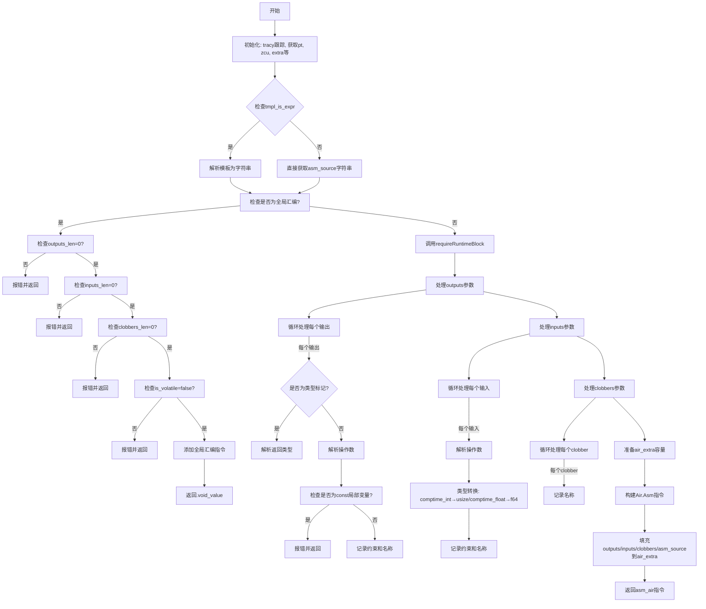

嗯，我现在需要帮用户画一个Zig函数的流程图。这个函数是zirAsm，看起来是处理内联汇编的部分。首先，我得理解这个函数的结构和逻辑流程。

首先，函数开始时会做一些初始化的操作，比如调用trace，然后defer结束trace。接下来，获取一些上下文变量，比如pt、zcu、extra等。然后处理asm_source，根据tmpl_is_expr的值来决定如何获取汇编模板字符串。

然后检查是否是全局汇编（is_global_assembly），如果是的话，验证outputs、inputs、clobbers的长度是否为0，并且is_volatile是否为false，否则报错。然后添加全局汇编到zcu，返回void_value。

如果不是全局汇编，继续处理，调用requireRuntimeBlock。接着初始化一些变量，比如extra_i、output_type_bits、needed_capacity。然后处理输出参数（outputs），遍历每个输出，检查是否是类型，如果是则解析类型，否则解析操作数。同时处理约束和名称，记录到outputs数组中。这里还要检查是否有const本地变量被输出，如果有的话报错。

接下来处理输入参数（inputs），同样遍历每个输入，解析操作数，处理类型转换，比如将comptime_int转为usize，comptime_float转为f64。记录约束和名称到inputs数组。

然后处理clobbers，获取每个clobber的名称，更新needed_capacity。之后处理汇编源代码，将asm_source写入air_extra。

最后，构建Air.Asm结构，填充各种参数，将out_args、args、outputs、inputs、clobbers、asm_source写入air_extra，返回asm_air指令。

现在需要将这些步骤转化为流程图。流程图应该从函数入口开始，逐步展示各个判断和处理分支。比如，首先初始化，然后判断是否是全局汇编，如果是则处理全局汇编的错误检查并返回，否则继续处理输出、输入、clobbers，最后生成Air指令。

需要注意条件分支，比如is_global_assembly的判断，tmpl_is_expr决定如何获取asm_source，以及循环处理outputs、inputs、clobbers的部分。每个循环部分可以用子流程或循环节点表示。

可能的结构是：

1. 开始
2. 初始化：tracy跟踪，获取变量
3. 处理asm_source（条件判断tmpl_is_expr）
4. 检查is_global_assembly
   - 是：检查各参数是否为0，添加全局汇编，返回void_value
   - 否：继续后续处理
5. 调用requireRuntimeBlock
6. 处理outputs：循环每个输出，解析类型或操作数，记录约束和名称
7. 处理inputs：循环每个输入，类型转换，记录约束和名称
8. 处理clobbers：循环每个clobber，记录名称
9. 准备air_extra容量
10. 构建Air.Asm指令，填充数据到air_extra
11. 返回asm_air

每个步骤中的条件判断需要用菱形节点，循环处理部分用循环结构。同时，错误处理部分（如fail返回）也需要在流程图中体现，比如在全局汇编检查时如果参数不符合要求，直接返回错误。

可能还需要注意各个部分的顺序，比如outputs处理在inputs之前，clobbers在最后。此外，处理每个输出、输入时涉及的子步骤，如解析约束和名称，可能需要细化。

这样整理后，可以逐步绘制出流程图的结构，用mermaid语法表示出来。
================================================
