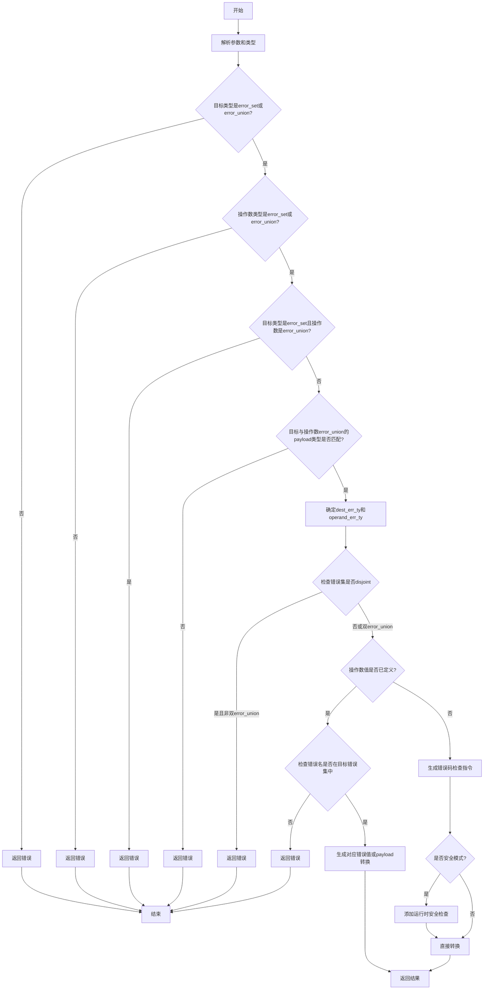

好的，我需要帮用户用Mermaid画出这个Zig函数的流程图。首先，我得仔细阅读并理解这个函数的逻辑。这个函数名为zirErrorCast，看起来是处理错误类型转换的。函数开始部分获取一些上下文信息，比如pt、zcu、ip等，然后解析操作数和目标类型。

接下来，函数检查目标类型和操作数类型的标签（tag），确保它们都是错误集（error set）或错误联合（error union）。如果不符合条件，就会返回相应的错误信息。这里有几个条件判断，比如目标类型是错误集而操作数是错误联合，或者两者的payload类型不匹配，这些都需要在流程图中体现出来。

然后，函数处理错误类型的交集问题，检查是否不相交（disjoint）。如果disjoint为真且不是两者都是错误联合的情况，就会返回错误。这部分逻辑有点复杂，可能需要拆分成几个步骤，比如检查dest_err_ty和operand_err_ty是否为空，或者是否是anyerror，然后遍历错误名称判断是否有交集。

之后，处理操作数的具体值，如果是已定义的错误值，会进一步检查是否属于目标错误集。如果是错误联合且payload存在，则进行类型转换。如果操作数是未定义的，则生成相应的错误码检查指令，并在安全模式下添加运行时检查。

最后，根据操作数和目标类型的不同组合，生成相应的位转换或包装操作。

为了画流程图，我需要把这些步骤分解成各个节点，并用箭头连接起来。每个条件判断（比如if语句）会导致分支，需要菱形判断框。错误处理和返回路径也要明确标出。可能需要注意循环结构，比如遍历错误名称的部分，但看起来这里用的是for循环，但在流程图中可能需要用条件判断来表示循环结束的条件。

另外，有些步骤可能会抛出错误，需要用不同的路径表示错误返回。例如，多次调用sema.fail或sema.failWithOwnedErrorMsg，这些都需要在流程图中体现为终止节点或错误处理节点。

最后，确认所有可能的执行路径都被覆盖，没有遗漏的条件分支，流程图的结构清晰，层次分明。可能需要将复杂的逻辑块拆分成子流程，但考虑到用户要求的是整个函数的流程图，应该尽量在一个图中呈现主要步骤，避免过于复杂。

总结一下，流程图的大致结构是：
1. 开始
2. 解析参数和类型
3. 检查目标类型和操作数类型是否符合要求（错误集或错误联合）
4. 处理错误联合的payload类型匹配问题
5. 检查错误集是否不相交
6. 根据disjoint结果进行不同的错误处理或继续执行
7. 处理已定义的操作数值或生成运行时检查
8. 根据类型组合生成最终的转换指令
9. 结束或返回错误

在绘制时，每个判断点用菱形，处理步骤用矩形，错误返回用终止符。需要确保每个条件分支都正确连接，特别是嵌套的if语句和循环部分。
================================================
