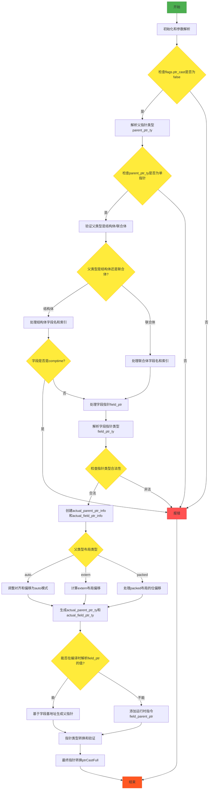

嗯，我需要用Mermaid来画这个函数的流程图。首先，我得仔细阅读这个Zig函数，理解它的逻辑结构。这个函数的名字是zirFieldParentPtr，看起来是处理结构体或联合体父指针的。

首先，函数开始处获取了一些基本参数，比如pt、zcu、ip。然后从extra数据中提取了FieldParentPtr的信息，检查了flags，确保ptr_cast是false。接着处理源节点和字段名、指针的源信息。

接下来，函数解析父指针类型parent_ptr_ty，检查其是否为单指针，如果不是就报错。然后确认父类型是结构体或联合体，否则报错。然后处理字段名，根据父类型是结构体还是联合体获取字段索引。如果是结构体的编译时字段，也会报错。

然后处理字段指针field_ptr，检查指针类型。之后创建实际的父指针和字段指针的信息，根据父类型的布局（auto、extern、packed）调整对齐和偏移量。最后进行类型转换和指针运算，生成结果。

流程图的步骤大致如下：
1. 初始化和参数解析
2. 检查flags和ptr_cast
3. 解析父指针类型并验证
4. 检查父类型是否为结构体/联合体
5. 解析字段名并获取字段索引
6. 处理字段指针并验证类型
7. 根据父类型布局调整指针信息
8. 生成结果（可能包括运行时检查或直接返回）
9. 最后的指针转换和返回

需要注意条件分支，比如父类型是结构体还是联合体，布局的不同处理方式，以及可能的错误处理路径。每个错误检查点都可能跳转到失败返回。此外，在生成结果时，根据是否能在编译时解析值，分为两种情况处理。

现在需要将这些步骤转化为Mermaid的流程图语法，使用不同的节点和条件判断，并连接相应的流程线。确保覆盖所有主要逻辑分支和错误处理。
================================================

流程说明：
1. 绿色节点为入口和正常结束节点
2. 黄色菱形为条件判断节点
3. 红色节点为错误处理路径
4. 主要逻辑分支包含：
   - 父类型验证
   - 字段索引计算
   - 指针信息调整（根据布局类型）
   - 编译时/运行时不同处理
   - 最终类型转换和结果返回
5. 每个错误检查点均直接跳转到报错流程
6. 布局处理部分（auto/extern/packed）会合并到共同的类型生成步骤