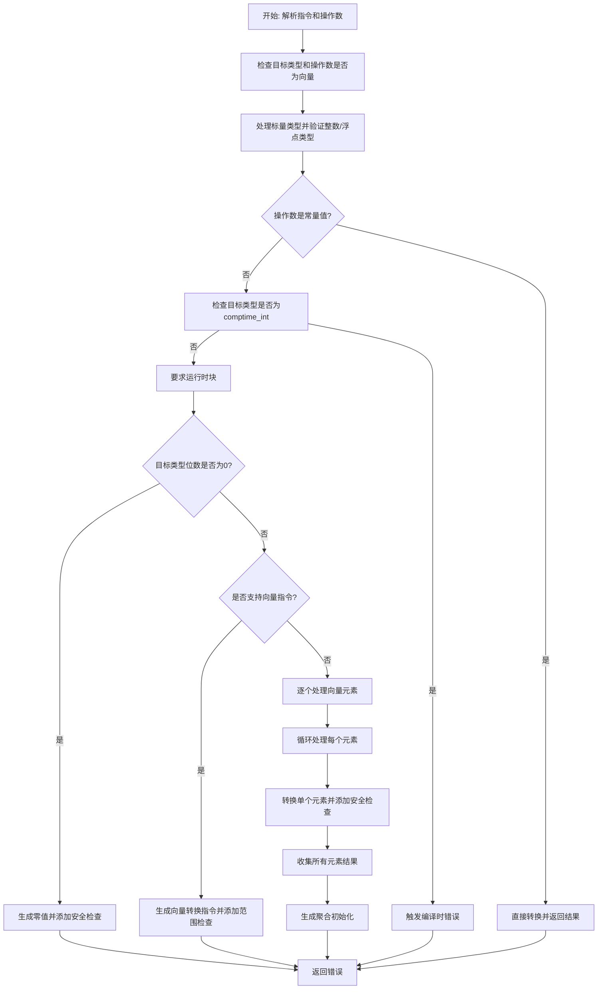

嗯，用户让我用Mermaid画出一个Zig函数的流程图。首先，我需要理解这个函数的功能。函数名是zirIntFromFloat，看起来是将浮点数转换为整数。函数内部有很多条件判断和错误处理，比如检查类型、处理向量类型、安全检查等等。

首先，我需要理清函数的主要流程。函数开始时会解析指令，获取源类型和目标类型，检查操作数是否为向量，然后处理标量类型。接着，如果有常量值，直接转换；否则处理运行时的情况，包括安全检查。对于向量类型，可能需要逐个元素处理或者使用向量指令优化。

接下来，我需要将每个步骤转化为流程图中的节点。可能的节点包括：解析指令、检查类型、处理常量值、处理运行时值、安全验证、向量处理等。每个条件判断（如是否为向量、是否支持向量指令等）会成为分支节点。

需要注意的是，函数中有多个条件分支，例如if (try sema.resolveValue(operand))、if (dest_scalar_ty.intInfo(zcu).bits == 0)、if (!is_vector or zcu.backendSupportsFeature(.all_vector_instructions))等。这些都需要在流程图中体现出来。

此外，错误处理部分，如try sema.checkIntType，也需要作为可能的失败路径。不过用户可能更关注主要流程，而非所有错误细节，所以可能需要简化错误处理的表示。

最后，根据Mermaid的语法，用合适的图形（矩形表示步骤，菱形表示判断）来组织这些节点，并用箭头连接它们，形成完整的流程图。需要确保逻辑正确，特别是循环处理向量元素的部分，可能需要用循环结构表示。

总结步骤：
1. 解析指令和操作数。
2. 检查目标类型和操作数类型是否为向量。
3. 处理标量类型，验证整数和浮点类型。
4. 检查操作数是否为常量，直接转换或处理编译时错误。
5. 要求运行时块，处理目标类型位数为0的特殊情况。
6. 根据是否支持向量指令，选择不同的处理路径。
7. 对于不支持向量指令的情况，逐个处理向量元素并进行安全检查。
8. 返回结果。

在绘制时，要确保所有条件分支都被覆盖，流程清晰，避免遗漏关键步骤。
================================================
