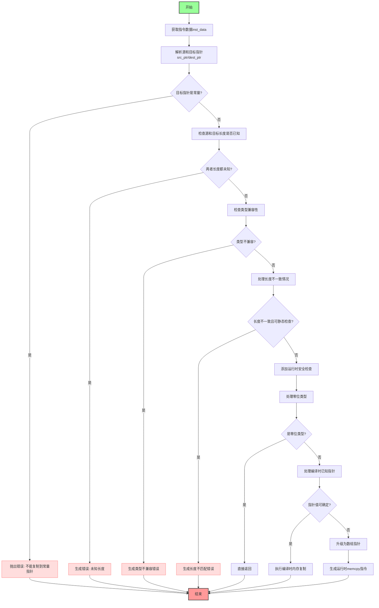

嗯，用户让我用Mermaid画出一个Zig函数的流程图。首先，我需要仔细看一下这个函数的结构和逻辑。这个函数叫做`zirMemcpy`，看起来是处理内存复制的语义分析部分。函数参数包括Sema、Block和指令索引，返回可能的编译错误。

首先，我应该理清函数的主要步骤。函数开始获取指令数据，解析源和目标指针，检查它们的类型和长度。然后进行各种错误检查，比如目标指针是否是常量、长度是否匹配、类型是否兼容等。接下来处理零位类型的情况，避免不必要的复制。之后处理编译时已知的指针和运行时的情况，添加安全检查和生成相应的AIR指令。

接下来，我需要把这些步骤转化为流程图。流程图通常从开始节点开始，然后是各个判断和操作步骤。根据代码的结构，可能需要多个判断分支，比如检查目标指针是否为常量、源和目标长度是否已知、类型是否兼容等。每个判断分支后可能有不同的处理路径，比如抛出错误或继续执行。

需要注意的是，代码中有多个错误处理点，比如`return sema.fail`，这些在流程图中应该表示为终止节点或错误节点。另外，循环和递归结构在这里可能不明显，但条件判断很多，需要仔细处理每个分支。

可能遇到的挑战是如何将复杂的逻辑判断和嵌套的条件转换为清晰的流程图。需要确保每个判断节点都有两个分支（是/否），并且流程连贯，不遗漏任何重要步骤。同时，需要处理一些细节，比如`zero_bit`标签后的处理，以及运行时安全检查的添加。

最后，生成Mermaid代码时，要使用正确的语法，如节点定义、箭头连接，以及条件判断的文本描述。确保每个步骤的描述简洁明了，便于理解整个函数的执行流程。
================================================
