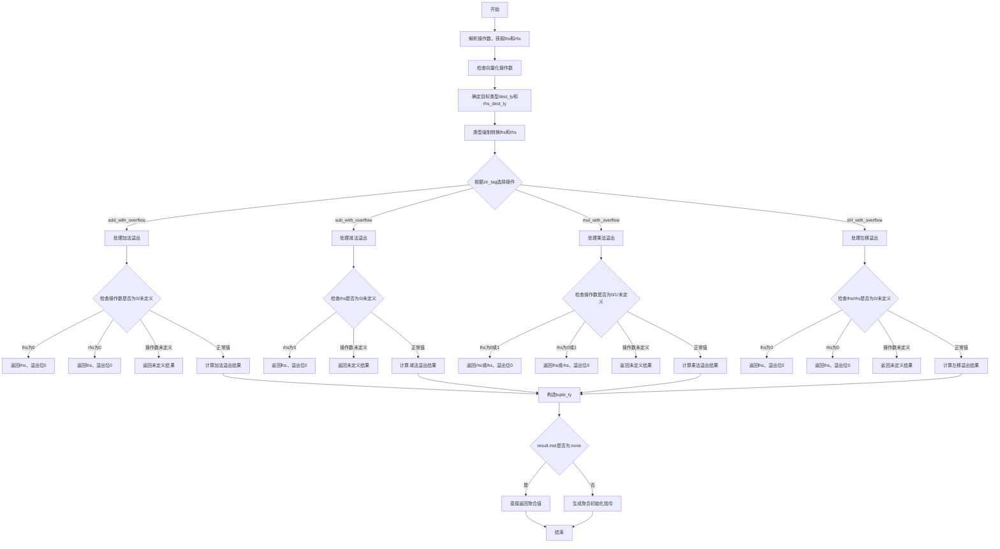

好的，我现在需要为这个Zig函数`zirOverflowArithmetic`画一个流程图。首先，我需要仔细阅读代码，理解它的逻辑结构和各个分支。

函数的大致流程应该是这样的：处理两个操作数，检查它们的类型，根据不同的算术操作（如加法、减法、乘法、左移）处理溢出情况，最后生成相应的Air指令或返回值。

首先，函数开始时会解析Zir指令的操作数，获取左右操作数的源代码位置和类型。然后检查这些操作数是否可以进行向量化操作。接下来，确定目标类型`dest_ty`，根据不同的`zir_tag`（比如`shl_with_overflow`），处理左右操作数的类型转换。

之后，根据不同的算术操作进入不同的分支，比如`.add_with_overflow`、`.sub_with_overflow`等。每个分支里会处理特殊情况，比如操作数为0或1时的情况，以及处理未定义值的情况。如果操作数是已知的常量值，可能会直接计算结果和溢出位；否则，生成相应的运行时指令。

在处理完这些逻辑后，函数会构造一个元组类型`tuple_ty`，包含结果值和溢出位。最后根据情况返回聚合初始化的结果或者Air指令。

接下来，我需要将这些步骤转化为流程图。每个主要步骤作为一个节点，条件判断作为分支。比如，处理不同的`zir_tag`会有不同的分支，每个操作符内部的条件判断（如操作数是否为0，是否为未定义值）也需要分支。

需要注意的是，代码中有很多条件判断和可能的提前返回，比如在处理操作数为0时直接返回结果，或者处理未定义值时返回未定义结果。这些都需要在流程图中体现出来。

此外，代码末尾根据`result.inst`是否存在来决定返回方式，这也是一个分支点。如果`result.inst`为`.none`，则直接返回聚合值；否则，生成聚合初始化的指令。

可能遇到的挑战是如何清晰地表达所有条件分支而不显得混乱。需要合理组织流程图的层级，使用子流程或分组来区分不同`zir_tag`的处理逻辑。

现在，我需要将这些逻辑结构用Mermaid的语法表示出来，确保每个步骤和分支都正确对应代码中的逻辑。
================================================
