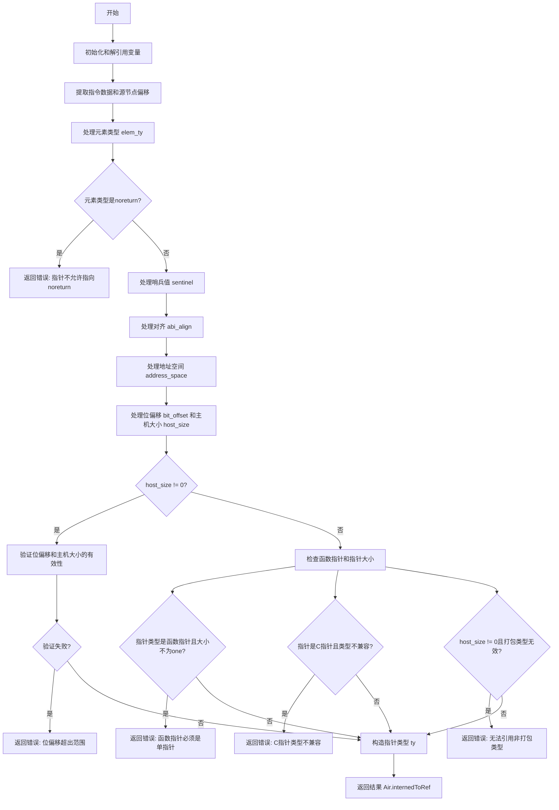

嗯，我需要为这个Zig函数`zirPtrType`画一个流程图。首先，我得理解这个函数的结构和逻辑流程。看起来这个函数处理指针类型的语义分析，可能有多个条件分支和错误检查。

首先，函数开始时会进行一些初始操作，比如获取跟踪信息，解引用某些变量，然后从指令中提取数据。接着，处理各种源节点偏移，比如`elem_ty_src`、`sentinel_src`等。然后进入处理元素类型的部分，这里有一个`blk`块，用来解析元素类型，并进行错误检查，比如是否是指向`noreturn`的类型。

接下来，处理sentinel（哨兵值）、对齐（alignment）、地址空间（address space）、位偏移（bit offset）和主机大小（host size）等属性。每个属性可能有条件判断，比如`has_sentinel`、`has_align`等标志位。每个部分都可能会有错误检查，比如对齐值的验证，地址空间的解析，位偏移和主机大小的有效性检查。

然后，处理函数指针的特殊情况，比如检查指针大小是否为`one`，或者C指针指向的类型是否符合要求。之后，验证打包类型（packed type）是否有效。

最后，构造指针类型并返回。

需要注意的是，每个条件分支都可能影响流程的走向，比如错误发生时返回错误信息，否则继续处理后续步骤。此外，各个部分的处理顺序可能影响流程图的结构。

可能的结构是：开始 -> 初始化 -> 处理元素类型 -> 检查元素类型是否为noreturn -> 处理sentinel -> 处理对齐 -> 处理地址空间 -> 处理位偏移和主机大小 -> 验证位偏移和主机大小的有效性 -> 处理函数指针的特殊情况 -> 验证C指针类型 -> 验证打包类型 -> 构造指针类型 -> 返回结果。

过程中需要处理多个错误情况，每个错误检查都可能提前返回错误。因此，流程图会有多个决策节点，每个节点对应一个条件判断，如果满足条件则进入错误处理路径，否则继续下一步。

可能需要使用Mermaid的流程图语法来表示这些步骤，用矩形表示操作，菱形表示条件判断，箭头表示流程方向。同时，错误处理路径可能需要单独的分支，最终汇聚到返回错误或成功结果的节点。
================================================
