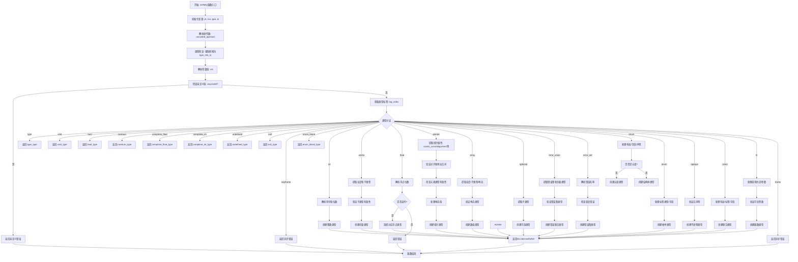

嗯，我现在需要为这个Zig函数`zirReify`画一个流程图。首先，我得仔细看看这个函数的结构和逻辑。这个函数似乎处理不同类型的ZIR指令，并根据不同的类型生成对应的Air指令引用。看起来有很多条件分支，每个类型（如int, vector, pointer等）有不同的处理流程。

首先，我需要理解函数的整体流程。函数开始部分有一些初始化的步骤，比如获取各种上下文（sema, block, extended等），然后处理操作数，检查未定义值。接着，根据不同的类型标签（tag_index）进入不同的处理分支。每个分支处理特定的类型，比如int类型会创建整数类型，pointer类型处理指针的各种属性等等。

接下来，我需要将这个过程分解成流程图中的各个步骤。流程图应该从函数入口开始，然后按照代码的执行顺序展开，遇到条件分支就分叉，每个分支处理对应的类型。最后，每个分支结束后返回相应的Air引用。

可能需要注意的是，这个函数中有大量的switch case，每个case对应不同的类型处理。例如，处理int类型时，会解析符号和位数，然后创建对应的类型。处理pointer时，会涉及大小、对齐、地址空间等多个属性。此外，有些分支可能会抛出错误，比如遇到不支持的浮点位数或无效的对齐值。

我需要确保在流程图中包含这些关键步骤，比如错误检查、类型解析、属性提取等。同时，也要注意函数的返回点，每个case处理完后都会返回相应的Air.Inst.Ref。

不过，可能有些复杂的逻辑需要更详细的分解。例如，在pointer的处理中，有很多字段需要提取和验证，比如size、is_const、alignment等，这些都需要在流程图中体现。同样，struct、enum等类型的处理也有各自的步骤，比如检查布局、处理字段等。

此外，还需要注意函数中的错误处理路径，比如当sema.fail被调用时，流程会直接返回错误，这些也需要在流程图中表示出来。

总结一下，流程图的步骤可能包括：

1. 函数入口
2. 初始化变量（pt, zcu, gpa等）
3. 解析操作数和类型信息
4. 检查未定义值
5. 根据类型标签分支到不同的处理流程
6. 每个类型处理流程中的详细步骤（如提取字段、验证属性、创建类型）
7. 错误处理路径
8. 返回相应的Air引用

在绘制时，可能需要为每个主要的类型处理分支创建一个子流程，特别是那些包含多个步骤的类型，如pointer、struct等。同时，错误检查需要作为条件判断节点出现，如果条件不满足则进入错误处理。

需要注意的是，由于代码较长，流程图可能会比较复杂，可能需要分层或分块来保持清晰。例如，主流程图中包含各个类型分支，而每个分支内部再展开详细步骤。

最后，确保流程图的逻辑与代码一致，没有遗漏重要的步骤或条件。可能需要多次检查代码，确认每个分支的处理步骤，尤其是那些容易出错的地方，比如指针的对齐检查、结构体的布局处理等。
================================================

这个流程图：
1. 以函数入口开始，初始化关键变量
2. 逐步展示类型解析和错误检查路径
3. 用菱形节点表示条件分支（如类型判断、错误检查）
4. 每个类型分支包含特定处理步骤
5. 最终统一收敛到类型引用返回
6. 包含错误处理路径（红色分支）
7. 使用子流程块处理复杂类型（如pointer/struct的处理逻辑）
8. 保持与代码结构的高度对应，同时进行逻辑分组简化