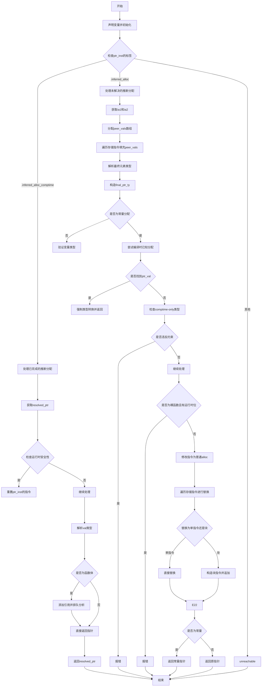

好的，我需要为给定的 Zig 函数 `zirResolveInferredAlloc` 绘制流程图。首先，我得理解这个函数的结构和逻辑流程。

函数开始部分，声明了一些变量和获取上下文信息。然后根据 `ptr_inst` 的标签进行分支判断。主要分为两种情况：`.inferred_alloc_comptime` 和 `.inferred_alloc`，以及最后的默认情况 `unreachable`。

对于 `.inferred_alloc_comptime` 分支，处理已经完成的推断分配，返回指针，并进行一些安全检查和类型处理。对于 `.inferred_alloc` 分支，处理未解决的推断分配，解析对等类型，验证变量类型，处理可能的编译时已知分配，并替换存储指令。最后，根据是否是常量返回不同的指针。

在绘制流程图时，需要考虑各个条件分支，特别是 `switch` 语句中的不同情况。每个分支内部可能还有子条件，比如在 `.inferred_alloc_comptime` 中的 `switch` 和 `.inferred_alloc` 中的多个 `if` 判断。

需要注意循环部分，比如 `for` 循环处理 `peer_vals` 和 `ia2.prongs.items`。同时，错误处理如 `try` 和 `return` 语句也需要体现在流程中。

可能遇到的挑战是如何将复杂的逻辑结构简化为清晰的流程图步骤，特别是嵌套的条件和循环。需要确保每个判断点和操作步骤都能正确表示，同时保持流程图的简洁性。

总结步骤：
1. 函数开始，初始化变量。
2. 根据 `ptr_inst` 的标签分支。
3. 处理 `.inferred_alloc_comptime` 情况。
4. 处理 `.inferred_alloc` 情况，包括解析对等类型、验证类型、处理存储指令等。
5. 返回相应的结果。
6. 处理其他情况为 `unreachable`。

需要将这些步骤以及子步骤用流程图的节点和箭头连接起来，确保逻辑顺序正确。
================================================
