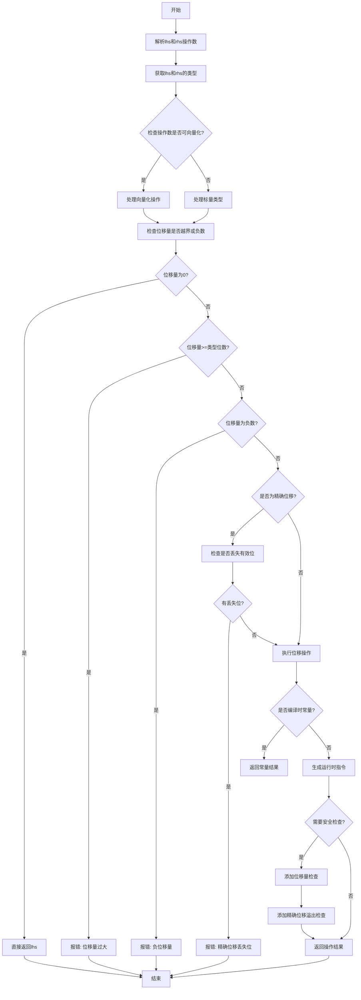

嗯，用户让我用Mermaid来画这个Zig函数的流程图。首先，我需要仔细阅读代码，理解它的结构和逻辑。这个函数名为zirShr，看起来是处理右移操作的，包括普通右移和精确右移。函数中涉及很多条件判断和错误处理，比如检查位移量是否过大、是否为负数，还有处理向量类型的情况。

首先，我需要确定函数的主要步骤。函数开始时会解析左右操作数，然后检查它们的类型和值。接着，处理不同的情况，比如位移量为0时的快速返回，或者位移量超过类型位数时的错误。然后，处理运行时安全检查，比如位移后是否溢出，或者是否需要精确移位。

接下来，我需要将这些步骤分解成流程图中的各个节点。每个条件判断（比如if语句）会生成分支，而每个操作（比如添加指令或返回错误）则是不同的节点。需要注意的是，代码中有多个可能的错误路径，比如shift amount太大或者为负数，这些都需要在流程图中体现出来。

另外，代码中使用了大量的Zig语法特性，比如switch语句、defer、以及各种方法调用。我需要将这些转化为流程图的逻辑结构。例如，switch语句根据air_tag选择不同的源代码位置，这可以表示为不同的分支。同时，处理向量类型时会有循环检查每个元素，这在流程图中可能需要一个循环结构或者多个条件判断。

还有，函数中有些部分是在编译时处理的，比如检查是否为comptime_int类型，而有些是运行时检查。这可能会影响流程图的分支，需要区分不同的情况。

在画流程图时，还要注意函数中的递归调用或深层嵌套结构，但在这个函数中似乎没有递归，主要是顺序执行和条件判断。因此，流程图的结构可能相对线性，但有很多分支。

最后，我需要确保所有可能的执行路径都被覆盖，包括正常返回和所有错误情况。每个错误返回点都应该在流程图中有一个对应的节点，并且路径要正确连接。

总结一下，步骤大致如下：
1. 解析左右操作数。
2. 检查操作数类型是否可向量化。
3. 处理位移量为0的情况。
4. 检查位移量是否超过类型位数或为负数。
5. 处理编译时常量情况。
6. 运行时安全检查。
7. 返回结果或错误。

在转换这些步骤为Mermaid流程图时，需要使用不同的节点表示开始、结束、操作、条件判断和错误处理。同时，确保箭头正确连接各个步骤，反映代码的执行流程。
================================================

流程说明：
1. 从解析左右操作数开始，获取类型信息
2. 检查操作数是否支持向量化操作
3. 对位移量进行多维度检查：
   - 是否为0值（快速返回）
   - 是否超过类型位数限制
   - 是否为负数
4. 处理精确位移的特殊检查（是否丢失有效位）
5. 根据是否编译时常量决定直接返回或生成运行时指令
6. 添加必要的运行时安全检查：
   - 位移量有效性检查
   - 精确位移的溢出检查
7. 最终返回操作结果或错误信息

菱形节点表示条件判断，矩形节点表示操作步骤，六边形节点表示错误处理，圆角矩形为开始/结束节点。箭头方向表示程序执行流程。