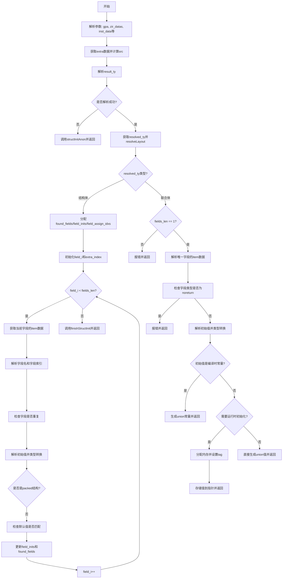

嗯，我现在需要为这个Zig函数zirStructInit画一个流程图。首先，我得理解这个函数的结构和逻辑流程。让我仔细读一下代码。

函数开头，定义了一些变量，比如gpa、zir_datas、inst_data、extra、src等。然后处理pt、zcu、ip，获取第一个_item的信息。接着，尝试解析result_ty，如果失败则调用structInitAnon。然后检查resolved_ty的类型，如果是结构体，执行结构体初始化的逻辑；如果是联合体，执行联合体初始化的逻辑。

对于结构体部分，代码分配了found_fields、field_inits、field_assign_idxs数组。然后进入一个循环，处理每个字段的类型和初始化值，检查是否有重复字段，是否有默认值，并进行类型强制转换。最后调用finishStructInit。

对于联合体部分，首先检查字段数量是否为1，否则报错。然后处理字段类型，检查是否是noreturn类型，处理初始值，如果是编译时常量则生成对应的值，否则处理运行时的初始化，可能需要分配内存，设置标签，存储指针等。

我需要将这些步骤分解成流程图中的各个节点和判断条件。可能的判断点包括：

1. 解析result_ty是否成功？如果失败，进入匿名结构体初始化。
2. resolved_ty的类型是结构体还是联合体？
3. 对于结构体，处理每个字段，检查是否已经存在，是否有默认值，是否类型匹配。
4. 对于联合体，检查字段数量是否为1，字段类型是否合法，是否为编译时已知值，是否需要分配内存等。

需要注意各个分支的处理，例如结构体中的循环处理字段，联合体中的不同情况处理。

可能的分支包括：

- 解析result_ty失败 → structInitAnon
- resolved_ty是结构体 → 结构体初始化流程
- resolved_ty是联合体 → 联合体初始化流程
- 结构体中的字段循环处理，每个字段的检查
- 联合体中的字段是否是noreturn类型 → 报错
- 初始值是否是编译时常量 → 生成常量，否则处理运行时

可能还需要处理错误情况，比如重复字段、类型不匹配、联合体字段数量不正确等。

现在需要将这些步骤用mermaid的流程图语法表示出来，包括开始、结束、判断节点、处理步骤等。要注意流程的顺序和分支的正确连接。

可能需要先画出主流程，然后细化结构体和联合体的子流程。例如：

开始 → 解析参数 → 解析result_ty → 是否成功？→ 失败：调用structInitAnon；成功→ 检查类型 → 结构体或联合体 → 分别处理 → 结束。

结构体处理部分包括分配数组、循环处理每个字段、检查默认值、类型转换等，最后调用finishStructInit。

联合体处理部分包括检查字段数量，处理字段，检查类型，处理初始值，分配内存（如果需要）等，最后返回结果。

需要注意循环结构在流程图中的表示，比如使用循环节点或者条件判断。同时，错误处理可能需要单独的分支，比如报错并返回。

现在需要将这些逻辑转化为具体的mermaid语法，确保每个步骤和判断正确连接，避免遗漏分支。
================================================

流程图说明：
1. 函数入口解析基础参数和源码位置
2. 尝试解析目标类型`result_ty`，失败则进入匿名结构体初始化
3. 类型确定后分支：
   - **结构体**：
     - 预分配字段跟踪数组
     - 循环处理每个字段：
       - 解析字段元数据
       - 检查字段重复性
       - 类型检查和值转换
       - 非packed结构时验证默认值
     - 最终完成结构体初始化
   - **联合体**：
     - 验证仅含一个字段
     - 检查字段有效性（如noreturn类型）
     - 处理编译时常量初始化或运行时内存分配
4. 错误路径贯穿全过程，最终返回初始化结果或错误